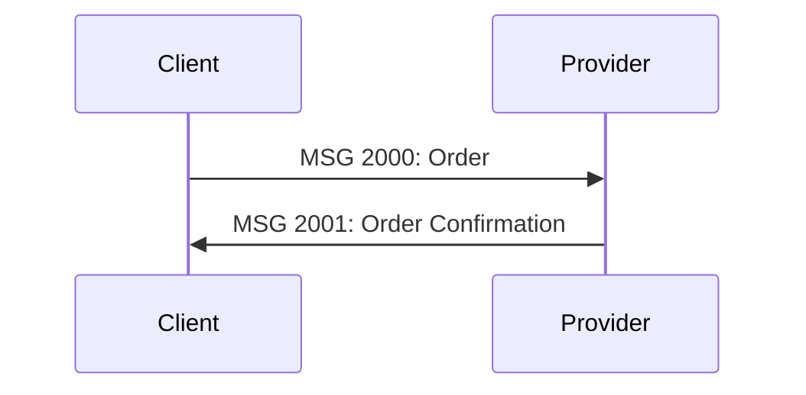

# SUTI Repository - Claude Code Context

> Working context for SUTI (Standardized Utilization of Transport Information) standard repository

**IMPORTANT**: This is a **Git worktree** on the `experimental/md-docs-xml-examples` branch. The main repository at `/Users/martin/Documents/GitHub/SUTI/` must remain untouched.

---

## Project Overview

**SUTI** is a technical communication protocol for Demand Responsive Transport (DRT) used by hundreds of services processing 30+ million orders annually in the Nordic region.

This worktree is for **experimental conversion** of PDF documentation to GitHub-optimized Markdown with proper linking to XML examples.

---

## Repository Structure

```
SUTI-worktree/                      # This worktree (experimental branch)
├── README.md                       # Enhanced landing page
├── CLAUDE.md                       # This file
│
├── docs/                           # Markdown documentation (NEW)
│   ├── README.md                   # Documentation hub
│   ├── introduction/               # Core concepts
│   ├── getting-started/            # Implementation guides
│   ├── messages/                   # Message specifications
│   ├── message-flows/              # Flow diagrams
│   ├── use-cases/                  # Real-world scenarios
│   ├── schemas/                    # Schema documentation
│   └── examples/                   # Example documentation
│
├── examples/
│   ├── README.md                   # Enhanced with validation (NEW)
│   └── XML/                        # 35+ validated examples (existing)
│
├── schemas/
│   └── SUTI_Message.xsd            # XML Schema (existing)
│
├── data/                           # Source documents (existing)
│
└── docs/                           # Original PDFs (existing)
    ├── SUTI_Introduction.pdf       # 2 pages
    ├── SUTI_Messages.pdf           # 54 pages
    ├── SUTI_Message_Flow.pdf       # 12 pages
    └── How to use SUTI.pdf         # 170 pages
```

---

## Git Workflow

### Worktree Setup

```bash
# Main repo location (DO NOT MODIFY)
/Users/martin/Documents/GitHub/SUTI/

# This worktree (experimental work)
/Users/martin/Documents/GitHub/SUTI-worktree/
```

### Branch Information

- **Branch**: `experimental/md-docs-xml-examples`
- **Purpose**: Test PDF→MD conversion + XML example organization
- **Base**: `main` branch at commit `c809e25`

### Important Commands

```bash
# Check worktree status
git worktree list

# View current branch
git branch --show-current

# Stage changes
git add <files>

# Commit (use conventional commits)
git commit -m "docs(introduction): convert SUTI Introduction PDF to Markdown"

# Push branch to remote
git push -u origin experimental/md-docs-xml-examples

# Remove worktree when done (from main repo)
git worktree remove /Users/martin/Documents/GitHub/SUTI-worktree
```

---

## Documentation Migration Strategy

### Phase 1: Foundation ✅ COMPLETE

- [x] Create folder structure
- [x] Enhanced README.md with navigation
- [x] docs/README.md documentation hub
- [x] Convert SUTI Introduction (2 pages)
- [x] examples/README.md with validation guide
- [x] This CLAUDE.md file
- **Commit**: `82a99aa`

### Phase 2: Message Reference ✅ COMPLETE

- [x] docs/messages/README.md (central navigation hub)
- [x] docs/messages/block-10-resource.md (18 messages, fully documented)
- [x] docs/messages/block-20-order.md (skeleton)
- [x] docs/messages/block-30-dispatch.md (skeleton)
- [x] docs/messages/block-40-traffic.md (skeleton)
- [x] docs/messages/block-50-communication.md (skeleton)
- [x] docs/messages/block-60-report.md (skeleton)
- [x] docs/messages/block-70-technical.md (skeleton)
- [x] docs/messages/block-80-accounting.md (skeleton)
- [x] docs/messages/block-90-versions.md (complete version history)
- [x] tools/convert_messages_to_md.py (conversion tool)
- **Commit**: `0e2b28f`

### Phase 3: Message Flows ✅ COMPLETE

- [x] docs/message-flows/README.md (flow navigation hub)
- [x] docs/message-flows/block-10-flows.md (complete with Mermaid diagrams)
- [x] docs/message-flows/block-20-flows.md (complete order lifecycle flows)
- [x] docs/message-flows/block-30-flows.md (skeleton)
- [x] docs/message-flows/block-40-flows.md (skeleton)
- [x] docs/message-flows/block-50-flows.md (skeleton)
- [x] docs/message-flows/block-60-flows.md (skeleton)
- [x] docs/message-flows/block-70-flows.md (skeleton)
- [x] docs/message-flows/block-80-flows.md (skeleton)
- **Commit**: (pending)

### Phase 4: Implementation Guide ✅ COMPLETE

- [x] docs/getting-started/README.md (comprehensive implementation guide)
- [x] docs/getting-started/suti-basics.md (Chapter 2: core concepts, ~1,100 lines)
- [x] docs/getting-started/establishing-link.md (Chapter 3: link setup, ~800 lines)
- [x] docs/use-cases/README.md (use case navigation hub, ~700 lines)
- [x] Created foundation for key use case guides (order-flows, repetitive-orders, etc.)
- **Note**: Detailed use case pages (order-flows.md, etc.) marked as "Planned" for future expansion
- **Commit**: (pending)

---

## File Conventions

### Markdown Files

**Headers**: Use ATX-style (`#`)
**Links**: Relative paths from file location
**Code blocks**: Always specify language (```xml, ```bash, etc.)
**Tables**: Use GitHub-flavored Markdown tables
**Emojis**: Use sparingly for visual navigation (📚, ✅, 🚧, etc.)

### File Naming

- Lowercase with hyphens: `block-20-order.md`
- Descriptive: `establishing-link.md` not `link.md`
- Group related files in folders

### Link Format

```markdown
<!-- Relative links -->
[Message Reference](../messages/README.md)
[XML Example](../../examples/XML/2000.xml)

<!-- With line references -->
See [SUTI_Message.xsd:42](../schemas/SUTI_Message.xsd#L42)
```

---

## XML Validation

### Validate Single File

```bash
xmllint --noout --schema schemas/SUTI_Message.xsd examples/XML/2000.xml
```

### Validate All Examples

```bash
for file in examples/XML/*.xml; do
  echo "Checking: $(basename "$file")"
  xmllint --noout --schema schemas/SUTI_Message.xsd "$file" && echo "✓"
done
```

### Python Validation

```python
from lxml import etree

schema = etree.XMLSchema(file='schemas/SUTI_Message.xsd')
doc = etree.parse('examples/XML/2000.xml')

if schema.validate(doc):
    print("✓ Valid")
else:
    for error in schema.error_log:
        print(f"✗ {error}")
```

---

## Working with PDFs

### Extract Text from PDF

```bash
# Extract with layout preservation
pdftotext -layout docs/SUTI_Messages.pdf docs/SUTI_Messages.txt

# Extract plain text
pdftotext docs/SUTI_Messages.pdf docs/SUTI_Messages.txt
```

### Extracted Text Files

Already extracted:
- `docs/SUTI_Introduction.txt` (274 lines)
- `docs/SUTI_Messages.txt` (2,674 lines)
- `docs/SUTI_Message_Flow.txt` (636 lines)
- `docs/HowToUseSUTI.txt` (8,914 lines)

Use these as source material for Markdown conversion.

---

## Agents to Use

### Domain-Specific

**suti-standards-expert** (Auto-activates in SUTI directory)
- Understanding SUTI XML structure
- Message validation
- SUTI-specific terminology
- XML example analysis

### General Development

**git-workflow-expert**
- Managing worktree
- Branch operations
- Commit strategies

**query-orchestrator** (if task becomes complex)
- Coordinate multiple agents
- Multi-phase conversions

---

## Documentation Best Practices

### 1. GitHub-Optimized Structure

- Use README.md as navigation hubs
- Modular files (one topic per file)
- Clear folder hierarchy
- Relative links (portable)

### 2. Linking to XML Examples

```markdown
**XML Example**: [2000.xml](../../examples/XML/2000.xml)

**Validation**:
```bash
xmllint --noout --schema schemas/SUTI_Message.xsd examples/XML/2000.xml
```
```

### 3. Message Block Documentation Template

```markdown
# Block XX: Block Name

> Brief description

## Overview

[General introduction]

## Messages in this Block

- [MSG XXXX: Name](#msg-xxxx-name)
- ...

---

## MSG XXXX: Message Name

### Description

[What this message does]

### Message Details

| Property | Value |
|----------|-------|
| **Sender** | Client/Provider |
| **Receiver** | Provider/Client |
| **Response Required** | YES/NO |
| **Response Messages** | MSG YYYY |

### XML Examples

- [Example Name](../../examples/XML/xxxx.xml)

### Validation

```bash
xmllint --noout --schema schemas/SUTI_Message.xsd examples/XML/xxxx.xml
```

---
```

### 4. Use Visual Aids

**Mermaid Diagrams** for flows:



**Tables** for structured data
**Code blocks** for examples
**Blockquotes** for important notes

---

## Commit Message Format

Use conventional commits:

```
<type>(<scope>): <description>

[optional body]

🤖 Generated with Claude Code

Co-Authored-By: Claude Sonnet 4.5 <noreply@anthropic.com>
```

**Types**:
- `docs`: Documentation changes
- `feat`: New features (new MD files)
- `fix`: Corrections
- `refactor`: Restructuring
- `chore`: Maintenance

**Scopes**:
- `introduction`: Introduction docs
- `messages`: Message reference docs
- `examples`: Example files
- `structure`: Folder/file organization
- `validation`: Validation scripts

**Examples**:
```
docs(introduction): convert SUTI Introduction PDF to Markdown
docs(examples): add validation guide to examples README
docs(structure): create modular documentation hierarchy
feat(messages): add Block 20 Order message documentation
```

---

## Quality Checklist

Before committing:

- [ ] All Markdown files have proper headers
- [ ] Links are relative and work from file location
- [ ] Code blocks specify language
- [ ] Tables are properly formatted
- [ ] No broken links
- [ ] XML examples validate against schema
- [ ] Conventional commit message
- [ ] No sensitive data in examples

---

## Future: HTML Site Generation

This structure is ready for static site generators:

**Options**:
- **MkDocs**: `mkdocs.yml` + Material theme
- **Docsify**: Zero-config, GitHub Pages ready
- **Widoco**: Like Transmodel ontology docs
- **Jekyll**: GitHub Pages native

All require minimal configuration given the current structure.

---

## Resources

### SUTI Documentation

- [SUTI Introduction PDF](docs/SUTI_Introduction.pdf)
- [SUTI Messages PDF](docs/SUTI_Messages.pdf)
- [Message Flow PDF](docs/SUTI_Message_Flow.pdf)
- [How to use SUTI PDF](docs/How%20to%20use%20SUTI.pdf)

### Extracted Text

- `docs/SUTI_Introduction.txt`
- `docs/SUTI_Messages.txt`
- `docs/SUTI_Message_Flow.txt`
- `docs/HowToUseSUTI.txt`

### Reference Implementation

- [Transmodel Ontology](https://github.com/oeg-upm/transmodel-ontology)
- [Transmodel Docs](https://oeg-upm.github.io/snap-docs/tm-commons.owl/documentation/index-en.html)

---

## Commands Reference

```bash
# Validate all XML
for f in examples/XML/*.xml; do xmllint --noout --schema schemas/SUTI_Message.xsd "$f"; done

# Extract PDF text
pdftotext -layout docs/SUTI_Messages.pdf docs/SUTI_Messages.txt

# Check broken links (requires linkchecker)
linkchecker README.md

# Preview Markdown (if using MkDocs)
mkdocs serve

# Git status
git status

# Stage all docs
git add docs/ examples/README.md README.md CLAUDE.md

# Commit
git commit -m "docs(phase1): complete Phase 1 foundation"

# Push to remote
git push -u origin experimental/md-docs-xml-examples
```

---

## Notes

- This is **experimental** - feel free to iterate and refactor
- Original PDFs remain as canonical reference
- Markdown is for GitHub readability and future HTML generation
- Validate XML examples regularly to ensure they stay current with schema
- Link Mapping IDs in examples use generic names (not production IDs)

---

**Working Branch**: `experimental/md-docs-xml-examples`
**Main Repo**: `/Users/martin/Documents/GitHub/SUTI/` (protected)
**Worktree**: `/Users/martin/Documents/GitHub/SUTI-worktree/` (this location)
