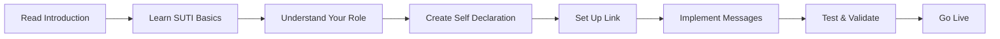
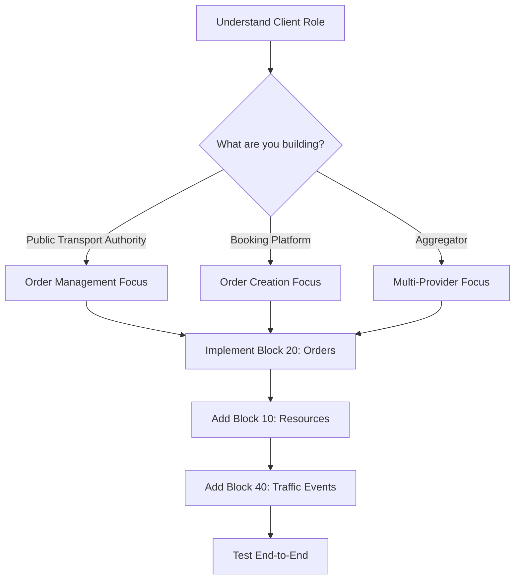
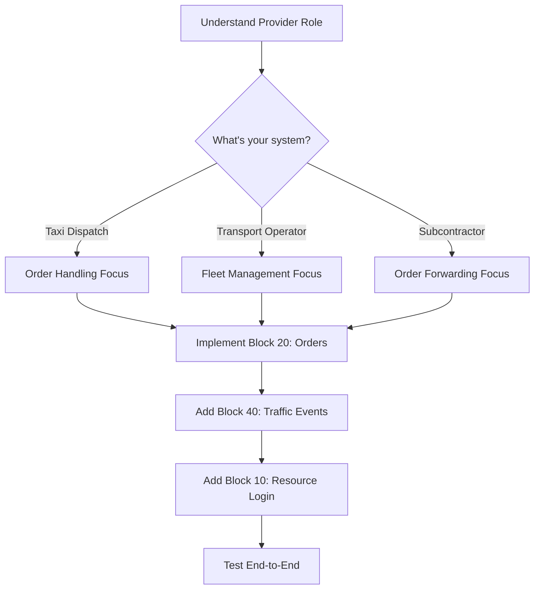

# Getting Started with SUTI

> Complete implementation guide for SUTI standard

---

## Overview

This section provides comprehensive guidance for implementing the SUTI standard in your Demand Responsive Transport (DRT) system. Whether you're building a **Client** (booking/planning system) or **Provider** (dispatch system), you'll find step-by-step instructions and best practices here.

---

## 📚 Implementation Path

### For New Implementations



**Recommended Reading Order**:
1. **[SUTI Basics](suti-basics.md)** - Core concepts and terminology
2. **[Establishing a Link](establishing-link.md)** - Setup and configuration
3. **[Communication Methods](communication-methods.md)** - HTTP and technical setup
4. **[GDPR & Security](gdpr-security.md)** - Privacy and security requirements
5. **[Use Cases](../use-cases/README.md)** - Real-world implementation scenarios

---

## Quick Start Guides

### I'm a Client Developer



**Start Here**:
1. Read [SUTI Basics → Client Role](suti-basics.md#client-role)
2. Review [Order Flows](../use-cases/order-flows.md)
3. Implement MSG 2000 (Order) and MSG 2001 (Confirmation)
4. Test with [XML Examples](../../examples/README.md)

### I'm a Provider Developer



**Start Here**:
1. Read [SUTI Basics → Provider Role](suti-basics.md#provider-role)
2. Review [Traffic Control Flows](../use-cases/traffic-control.md)
3. Implement MSG 1020 (Resource Login)
4. Test with [XML Examples](../../examples/README.md)

---

## Implementation Guides

### Core Concepts

| Guide | Description | Status |
|-------|-------------|--------|
| **[SUTI Basics](suti-basics.md)** | Terms, concepts, and architecture | ✅ Complete |
| **[Establishing a Link](establishing-link.md)** | Setup, self-declaration, link mapping | ✅ Complete |
| **[Communication Methods](communication-methods.md)** | HTTP protocols and technical setup | 📋 Planned |
| **[GDPR & Security](gdpr-security.md)** | Privacy, security, data protection | 📋 Planned |

### Implementation Steps

| Step | Guide | Status |
|------|-------|--------|
| **1. Planning** | [Requirements Analysis](planning-requirements.md) | 📋 Planned |
| **2. Design** | [Architecture Design](design-architecture.md) | 📋 Planned |
| **3. Development** | [Implementation Guide](development-guide.md) | 📋 Planned |
| **4. Testing** | [Testing & Validation](testing-validation.md) | 📋 Planned |
| **5. Deployment** | [Going Live](deployment-guide.md) | 📋 Planned |

---

## Prerequisites

### Technical Requirements

**For Client Systems**:
- HTTP client library
- XML/JSON parser
- Database for order management
- Message queue (recommended)

**For Provider Systems**:
- HTTP server/client
- XML/JSON parser
- Dispatch system integration
- Real-time location tracking

**Both Need**:
- SUTI membership (for official implementation)
- Software name approval from Technical Committee
- Understanding of DRT operations

### Knowledge Requirements

- Basic understanding of:
  - HTTP protocols
  - XML/JSON data formats
  - Asynchronous messaging
  - Database operations
- Familiarity with:
  - Transport/taxi operations
  - Demand Responsive Transport concepts

---

## SUTI Membership

### Becoming an Official Implementation

To be recognized as an official SUTI implementation:

1. ✅ **Join SUTI** - Your organization becomes a member
2. ✅ **Name Approval** - Software name approved by Technical Committee
3. ✅ **Self Declaration** - Complete and submit self-declaration document
4. ✅ **Link Mapping** - Complete setup process with partner
5. ✅ **Validation** - Messages validate against XSD schema

[Learn about membership →](establishing-link.md#suti-membership)

---

## Implementation Checklist

### Phase 1: Foundation
- [ ] Read SUTI Basics documentation
- [ ] Understand Client vs Provider roles
- [ ] Review message blocks and types
- [ ] Study XML/JSON message format
- [ ] Review XSD schema

### Phase 2: Planning
- [ ] Define your role (Client or Provider)
- [ ] Identify required message blocks
- [ ] Choose communication method
- [ ] Plan self-declaration content
- [ ] Identify integration points

### Phase 3: Development
- [ ] Set up development environment
- [ ] Implement message parsing
- [ ] Implement core message types
- [ ] Add validation against XSD
- [ ] Implement error handling

### Phase 4: Testing
- [ ] Unit test message creation
- [ ] Validate against XSD schema
- [ ] Integration test with partner
- [ ] End-to-end testing
- [ ] Performance testing

### Phase 5: Deployment
- [ ] Complete self-declaration
- [ ] Submit for Technical Committee approval
- [ ] Complete link mapping
- [ ] Deploy to production
- [ ] Monitor and maintain

---

## Common Implementation Patterns

### Pattern 1: Simple Order Flow

**Use Case**: Basic taxi booking system

**Minimum Messages**:
- MSG 2000: Order
- MSG 2001: Order Confirmation
- MSG 4010: Event Confirmation (Pickup/Drop-off)

[View detailed flow →](../use-cases/order-flows.md#basic-flow)

### Pattern 2: Shared Ride Service

**Use Case**: Multi-passenger optimization

**Required Messages**:
- All from Pattern 1, plus:
- MSG 2100: DriverSession (recommended)
- MSG 2040: Linked Orders
- MSG 2020: Node Cancellation

[View detailed flow →](../use-cases/order-flows.md#shared-ride-flow)

### Pattern 3: Recurring Transport

**Use Case**: School transport, medical appointments

**Required Messages**:
- MSG 2800: OrderTemplate
- MSG 2801: OrderTemplateConfirmation
- All from Pattern 1

[View detailed flow →](../use-cases/order-flows.md#recurring-orders)

---

## Development Tools

### Validation

```bash
# Validate XML message
xmllint --noout --schema schemas/SUTI_Message.xsd message.xml

# Validate all messages
for file in examples/XML/*.xml; do
  xmllint --noout --schema schemas/SUTI_Message.xsd "$file"
done
```

### Testing

- **[XML Examples](../../examples/README.md)** - 35+ validated examples
- **[Message Reference](../messages/README.md)** - Complete specifications
- **[Flow Diagrams](../message-flows/README.md)** - Visual guides

### Libraries & SDKs

Currently, SUTI implementations are custom-built. Common approaches:

**XML Processing**:
- Python: `lxml`, `xmlschema`
- Java: JAXB, DOM parsers
- .NET: System.Xml
- Node.js: `xml2js`, `fast-xml-parser`

**HTTP Communication**:
- Python: `requests`, `aiohttp`
- Java: Apache HttpClient, OkHttp
- .NET: HttpClient
- Node.js: `axios`, `node-fetch`

---

## Best Practices

### Message Design

1. **Unique IDs**: Always use unique message IDs
2. **Idempotency**: Handle duplicate messages gracefully
3. **Validation**: Validate against XSD before sending
4. **Error Handling**: Implement comprehensive error handling
5. **Logging**: Log all messages for audit trail

### Communication

1. **Timeouts**: Set reasonable timeouts (30-60 seconds)
2. **Retries**: Implement retry logic with exponential backoff
3. **Queue**: Use message queue for reliability
4. **Monitoring**: Monitor message flow and failures
5. **Testing**: Test all error scenarios

### Security

1. **HTTPS**: Always use HTTPS in production
2. **Authentication**: Implement proper authentication
3. **Authorization**: Verify message sender
4. **Encryption**: Encrypt sensitive data
5. **GDPR**: Follow data protection requirements

[Read full security guide →](gdpr-security.md)

---

## Getting Help

### Documentation Resources

- **[SUTI Basics](suti-basics.md)** - Core concepts
- **[Message Reference](../messages/README.md)** - All message types
- **[Message Flows](../message-flows/README.md)** - Visual diagrams
- **[Use Cases](../use-cases/README.md)** - Real-world examples
- **[XML Examples](../../examples/README.md)** - Validated examples

### Original PDFs

- [SUTI Introduction](../SUTI_Introduction.pdf) - Quick overview (2 pages)
- [SUTI Messages](../SUTI_Messages.pdf) - Message specs (54 pages)
- [Message Flow](../SUTI_Message_Flow.pdf) - Flow diagrams (12 pages)
- [How to use SUTI](../How%20to%20use%20SUTI.pdf) - Complete guide (170 pages)

### Support

- **Technical Committee**: Contact via SUTI organization
- **GitHub Issues**: [Report documentation issues](https://github.com/SUTI-se/SUTI/issues)
- **Community**: Connect with other SUTI implementers

---

## Next Steps

Ready to start implementing? Choose your path:

1. **Learn the Basics** → [SUTI Basics](suti-basics.md)
2. **Set Up a Link** → [Establishing a Link](establishing-link.md)
3. **See Examples** → [Use Cases](../use-cases/README.md)
4. **Start Coding** → [XML Examples](../../examples/README.md)

---

[← Back to Documentation Hub](../README.md) | [Continue to SUTI Basics →](suti-basics.md)
