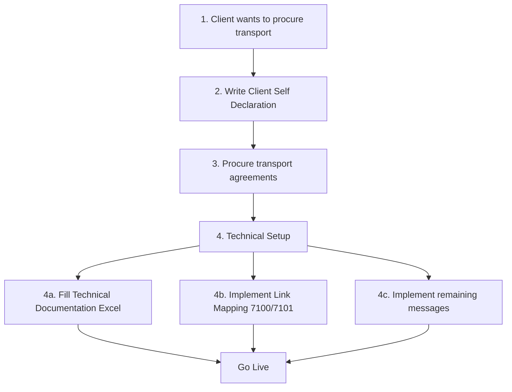
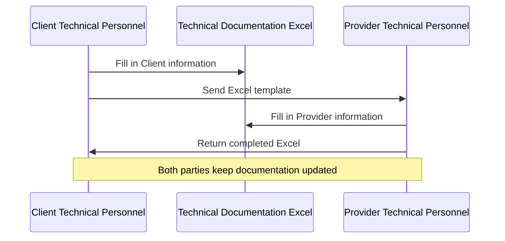
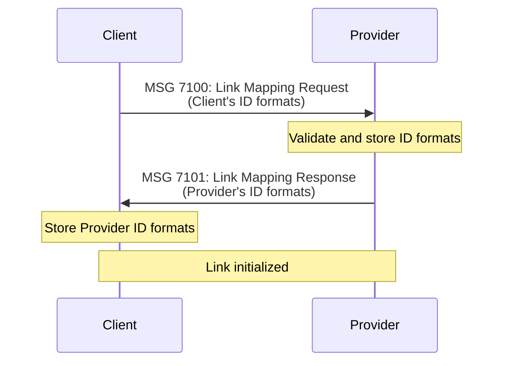
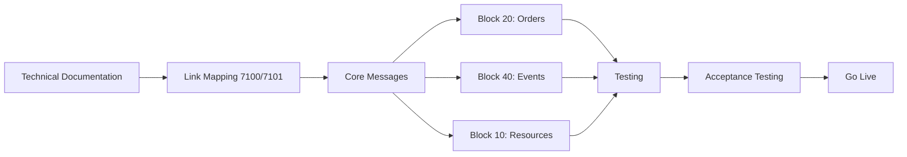

# Establishing a SUTI Link

> Step-by-step guide to setting up a SUTI connection between Client and Provider

---

## Overview

A **SUTI Link** is the technical communication setup between a Client system and a Provider system for a specific Agreement. This guide covers the complete process from procurement to going live.

---

## Table of Contents

- [Workflow Overview](#workflow-overview)
- [Self Declaration](#self-declaration)
- [Technical Documentation](#technical-documentation)
- [Link Mapping](#link-mapping)
- [Implementation and Testing](#implementation-and-testing)
- [RFP Guidelines](#rfp-guidelines)

---

## Workflow Overview

### Common Workflow for Establishing a Link



---

## Self Declaration

### What is a Self Declaration?

A **Client Self Declaration** is the primary definition of what parts of the SUTI standard need to be implemented when creating a SUTI Link for a specific Client.

**Purpose**:
- Stable description of how Client uses SUTI
- Requirements specification for Providers
- Basis for procurement documents
- Implementation guide for developers

**Target Audience**: Provider system manufacturers and developers.

---

### Benefits of Client Self Declaration

Creating a Client Self Declaration provides:

✅ **Clarity**: Ensures understanding among Providers of what you want to accomplish

✅ **Acceptance**: Description has wide acceptance among Providers

✅ **Reduced Problems**: Minimizes potential issues in Provider relations

✅ **Efficiency**: One-time effort that pays off quickly

✅ **Simplified Tenders**: Minimize technical descriptions in procurement

✅ **Lower Risk**: Offers with reduced risk due to clear requirements

---

### Client Self Declaration Structure

A Client Self Declaration should contain the following chapters:

#### 1. Description of the Organization

Brief description of the Client organization. Can be very short (e.g., reference to webpage URL).

---

#### 2. Business Model

Answer these questions:

**Travellers**:
- What characterizes the travellers and their general requirements?
- How are trips collected?

**Providers**:
- What type of business is done with Providers?
- How is service requested?
- Are there mechanisms like logical Vehicles or other tools?

**Contracts**:
- What is the outline of a typical contract? (who, where, when, scope)
- What software is used?

---

#### 3. Flows

For each Message Flow, document:

- ✅ **Objective** of the Flow
- ✅ **Trigger** of the Flow
- ✅ **Specific conditions** at send time
- ✅ **Demands on action** at Provider/Client
- ✅ **Demands on response**
- ✅ **Handling** if no response
- ✅ **Reference** to SUTI Use Cases
- ✅ **Comments** vital to the Flow
- ✅ **Examples** of request and response

**Start with**: List of all messages that are exchanged.

**Important**: All Flows must be documented.

---

#### 4. Use of Information Elements

##### 4.1 ID Elements

All implementations must comply with rules for ID elements (see [Section 5.1.2](../messages/README.md#id-structures)).

**Link Mapping Messages**:
- MSG 7100: Link Mapping Request
- MSG 7101: Link Mapping Response

These exchange structure and source definitions for all ID types.

##### 4.2 Other Elements

Document answers to relevant questions structured by SUTI Schema:

**At msg-level**:
- What will be the structure of orgReceiver?
- Are there additional referenceTo declarations?
- Do timestamps have specific meaning?

**At order-level**:
- How are agreement and idAgreement used?
- Is Product used? Implications?
- Are there interpretations for process tags?

**At economy**:
- Do we have price information? General or agreement-dependent?
- Do we use priceResponsible? What do we expect from Provider?
- Do we use payment? Specific use of idEkinfo?

**At resource**:
- Have requirements been transformed into capacity and attributes?
- Do we use IDs in any particular way?
- Do we use vehicleStartPosition? How should Provider use this?

**At node level**:
- What type of addresses will be handled?
- How are addresses verified?
- Do addresses comply with SUTI Use Cases?
- How is timesNode used? What timeTypes?
- What type of content is transported?
- Do we use content identification?
- Do we use connection? How should Provider use this?
- Specific demands for node information visible to driver?
- Do we use node process tags?

**For order reject**:
- How is order reject handled?
- Which rejection reasons are accepted? How presented?

**For order changes**:
- What are valid reasons for order change?
- Will Provider changes be accepted?
- How to handle when Provider cannot fulfill accepted order?

**For dispatch**:
- What detailed requirements on vehicle or driver?

**For vehicle positions**:
- What format types are supported?
- How to handle when coordinates unavailable?

**For events (4010)**:
- Are there critical events that need highlighting?
- What timeTypes are requested?

**For direct communication**:
- What are potential motives for these functions?

**For attributes**:
- Reference to webpage with actual attribute list
- Are there custom attributes? How presented to driver?
- Are there sources other than SUTI source? (should be avoided)

---

#### 5. Communication Method

Describe precisely how Provider should communicate with Client.

**Include**:
- Protocol (HTTP POST recommended)
- Endpoints (URLs)
- Authentication method
- Security requirements
- Link to technical documentation acceptable

See [Communication Methods](communication-methods.md) for standard approaches.

---

#### 6. Acceptance Testing

Document how acceptance testing should be performed.

**Include**:
- Test protocols to follow before production deployment
- Links to test documentation
- Test environment details

---

#### 7. Contact Information

Provide contact information for person responsible for Self Declaration for questions.

---

#### 8. Document Versioning

**Version Number Rules**:
- Start with **1.0** for first official version
- **Minor changes** (textual, no implementation impact): 1.1, 1.2, etc.
- **Major changes** (new flow, breaking changes): 2.0, 3.0, etc.

---

### Provider Self Declaration

Providers create simpler declarations containing:

- ✅ Types of connections supported
- ✅ Examples of implemented SUTI Links (who is Client and Provider)
- ✅ Reference to Client Self Declarations including restrictions

**No TC Review Required**: But Providers encouraged to make declarations publicly available.

**Storage**: SUTI provides possibility to store Self Declarations in [SUTI GitHub repository](https://github.com/SUTI-se/SUTI).

---

### SUTI Technical Committee Review

**For Clients**:
- TC available to review and provide feedback on drafts
- Good practice: Get feedback and final approval from TC before publishing
- Available to SUTI members

**Contact**: SUTI Technical Committee via [suti.se](https://suti.se)

---

## Technical Documentation

### Self Declaration Appendix - Technical Documentation

After agreement established, technical personnel complete the Excel template.

**Template Location**: [SUTI GitHub repo](https://github.com/SUTI-se/SUTI)

---

### Documentation Contents

**General Information**:
- Agreement and parties
- Reference to Client Self Declaration
- Contact information for technical personnel

**Technical Details**:
- Communication protocol
- SUTI Link URL
- VPN connection requirements (if any)
- Credentials storage and exchange
- Security requirements

---

### Responsibilities

Each party is responsible for:
- ✅ Keeping Technical Documentation updated
- ✅ Maintaining contact information
- ✅ Updates throughout Agreement life span

---

### Workflow



---

## Link Mapping

### Overview

**Link Mapping** defines the format of different ID Types used by the SUTI Link.

**Messages**:
- **MSG 7100**: Link Mapping Request (Client sends)
- **MSG 7101**: Link Mapping Response (Provider responds)

---

### Exchange Methods

Link Mapping can be provided in three ways:

#### 1. SUTI Communication Interface (Recommended)



**Advantage**: Programmatic exchange, easy updates

---

#### 2. Static XML Files

Exchange MSG 7100/7101 as XML files between Client and Provider.

**Advantage**: Can be reviewed before implementation

---

#### 3. Excel Template

Paste Link Mapping XML into designated sheets in Technical Documentation Excel.

**Advantage**: All technical documentation in one place

---

### ID Structures

Link Mapping lists all ID Types and formats.

**Common ID Types**:
- `idMsg`: Message ID
- `idOrder`: Order ID
- `idResource`: Resource (vehicle/driver) ID
- `idContent`: Content (passenger/parcel) ID
- `idAgreement`: Agreement ID
- `idOrg`: Organization ID (Link ID)

**Example MSG 7100** (simplified):
```xml
<SUTI>
  <msg msgType="7100" msgName="Link Mapping Request">
    <idType>
      <type>idMsg</type>
      <source>client_site_001:idMsg</source>
      <format>MSGYYYYMMDDNNNNNN</format>
      <description>Message ID: MSG + Date + Sequence</description>
    </idType>
    <idType>
      <type>idOrder</type>
      <source>client_site_001:idOrder</source>
      <format>ORD-NNNNNNN</format>
      <description>Order ID: ORD- + 7-digit number</description>
    </idType>
    <!-- More ID types -->
  </msg>
</SUTI>
```

**See**: [Section 5.1.2 ID Structures](../messages/README.md#id-structures) for complete details

---

### Keeping Contact Information Updated

**Important**: Contact information in Link Mapping XML must be kept up-to-date throughout Agreement life span.

---

## Implementation and Testing

### Implementation Phase

After Technical Documentation and Link Mapping complete:

**Developers** implement and test remaining SUTI Messages based on:
1. ✅ Official SUTI documentation
2. ✅ Guidelines in Client Self Declaration
3. ✅ Technical Documentation

---

### Implementation Sequence



---

### Recommended Implementation Order

1. **Technical Setup** (Block 70)
   - MSG 7100/7101: Link Mapping
   - MSG 7000/7001: Keep Alive

2. **Resource Management** (Block 10)
   - MSG 1020/1021/1022: Resource Login
   - MSG 1023/1024/1025: Resource Logoff

3. **Order Management** (Block 20)
   - MSG 2000: Order
   - MSG 2001: Order Confirmation
   - MSG 2002: Order Reject
   - MSG 2010/2011: Order Cancellation

4. **Traffic Control** (Block 40)
   - MSG 4010: Event Confirmation (Pickup/Drop-off)

5. **Additional Blocks** as needed:
   - Block 30: Dispatch
   - Block 60: Reports
   - Block 80: Accounting

---

### Testing Strategy

**Unit Testing**:
```bash
# Validate XML against schema
xmllint --noout --schema schemas/SUTI_Message.xsd message.xml
```

**Integration Testing**:
- Test with partner system
- Verify message flows
- Handle error scenarios

**Acceptance Testing**:
- Follow Client's acceptance test protocol
- Document test results
- Get sign-off before production

See [Testing Guide](testing-validation.md) for detailed procedures.

---

## RFP Guidelines

### Requirements for Proposal (RFP) Including SUTI

When Client issues RFP or public procurement requiring SUTI:

#### 1. Client Self Declaration

**Include**:
- As appendix to procurement documents, OR
- Reference to publicly available Self Declaration

---

#### 2. Technical Documentation Template

**Include**:
- Self Declaration Appendix - Technical Documentation Excel
- Can be used by Client and Provider to exchange technical information

---

#### 3. Additional Clarifications

Even if not affecting SUTI implementation itself, include:

**Hardware Requirements**:
- New hardware needed in vehicles
- New use of existing equipment (card readers, etc.)
- How represented in SUTI communication

**Driver Actions**:
- Specific actions by drivers required
- How handled by Provider system
- Must be precisely documented

**Economic Information**:
- How fines/fees transmitted via SUTI
- Which message types and events
- Information elements used

**Mandatory Elements**:
- Optional elements that are mandatory for this Client
- Elements/attributes with specific required values

**Unexpected Situations**:
- Procedure for handling undocumented situations

**Test Conditions**:
- Test and acceptance conditions before going live

**System Communication**:
- Specific requirements on communication

**Technical Organization**:
- Organization for test and live operations of SUTI Links

---

## SUTI Membership

### Becoming an Official Implementation

To be recognized as an official SUTI implementation:

1. ✅ **Join SUTI** - Organization becomes a member
2. ✅ **Name Approval** - Software name approved by Technical Committee
3. ✅ **Self Declaration** - Complete and submit Self Declaration
4. ✅ **Link Mapping** - Complete setup process with partner
5. ✅ **Validation** - Messages validate against XSD schema

**Benefits**:
- Official recognition
- TC support and guidance
- Access to member resources
- Networking with other implementers

**Learn More**: [suti.se](https://suti.se)

---

## Quick Checklist

### Before Procurement

- [ ] Join SUTI organization (optional but recommended)
- [ ] Study existing Client Self Declarations
- [ ] Draft Client Self Declaration
- [ ] Get TC review and approval
- [ ] Prepare procurement documents

### During Procurement

- [ ] Include Client Self Declaration in RFP
- [ ] Include Technical Documentation template
- [ ] Clarify hardware and driver requirements
- [ ] Specify test and acceptance conditions

### After Contract Signed

- [ ] Exchange Technical Documentation
- [ ] Implement Link Mapping (7100/7101)
- [ ] Implement core messages per Self Declaration
- [ ] Unit test with XSD validation
- [ ] Integration test with partner
- [ ] Acceptance testing
- [ ] Go live

### Ongoing

- [ ] Keep Technical Documentation updated
- [ ] Keep contact information current
- [ ] Monitor Link health (7000 Keep Alive)
- [ ] Update Self Declaration for major changes

---

## Common Pitfalls

### ❌ Avoid These Mistakes

**Incomplete Self Declaration**:
- Missing essential flows
- Vague requirements
- No examples

**Poor ID Design**:
- Non-unique IDs
- Changing ID formats mid-implementation
- Missing source information

**Inadequate Testing**:
- Skipping XSD validation
- No integration testing
- Insufficient error handling

**Stale Documentation**:
- Outdated contact information
- Technical Documentation not maintained
- No version control of Self Declaration

---

## Resources

### Templates and Examples

- **[Self Declaration Template](https://github.com/SUTI-se/SUTI)** - Excel template
- **[Existing Self Declarations](https://github.com/SUTI-se/SUTI)** - Examples from major Clients
- **[Link Mapping Examples](../../examples/XML/)** - MSG 7100/7101 examples

### Documentation

- **[SUTI Basics](suti-basics.md)** - Core concepts
- **[Communication Methods](communication-methods.md)** - HTTP POST setup
- **[Message Reference](../messages/README.md)** - All message types
- **[Use Cases](../use-cases/README.md)** - Real-world scenarios

### Support

- **SUTI Technical Committee**: Contact via [suti.se](https://suti.se)
- **GitHub Issues**: [Report documentation issues](https://github.com/SUTI-se/SUTI/issues)
- **Community**: Connect with other SUTI implementers

---

## Next Steps

Ready to implement?

1. **Read**: [SUTI Basics](suti-basics.md) for core concepts
2. **Study**: Existing Self Declarations for examples
3. **Draft**: Your Client Self Declaration
4. **Contact**: SUTI Technical Committee for review
5. **Implement**: Following this guide

---

[← SUTI Basics](suti-basics.md) | [Back to Getting Started](README.md) | [Communication Methods →](communication-methods.md)
