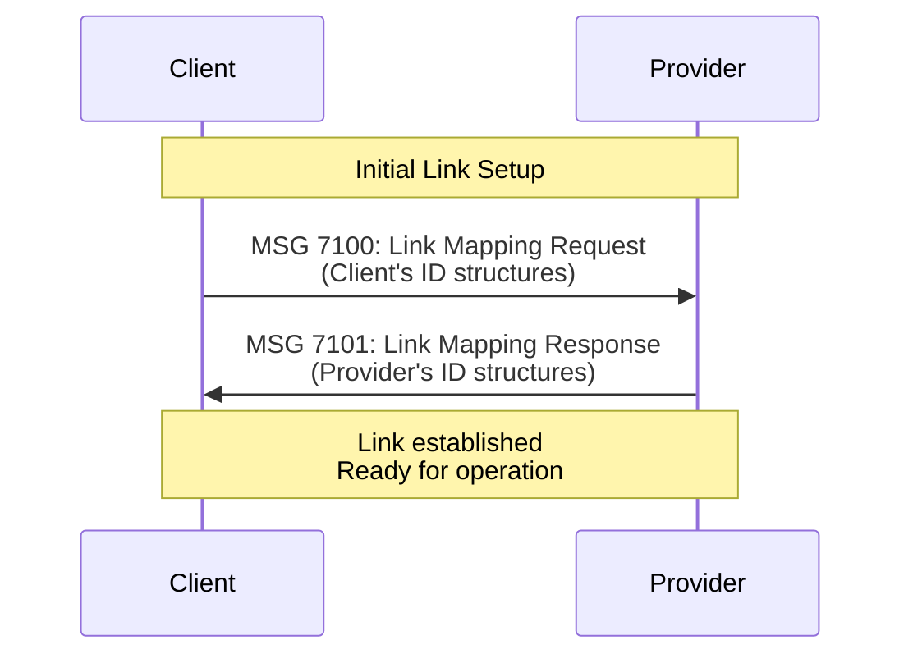
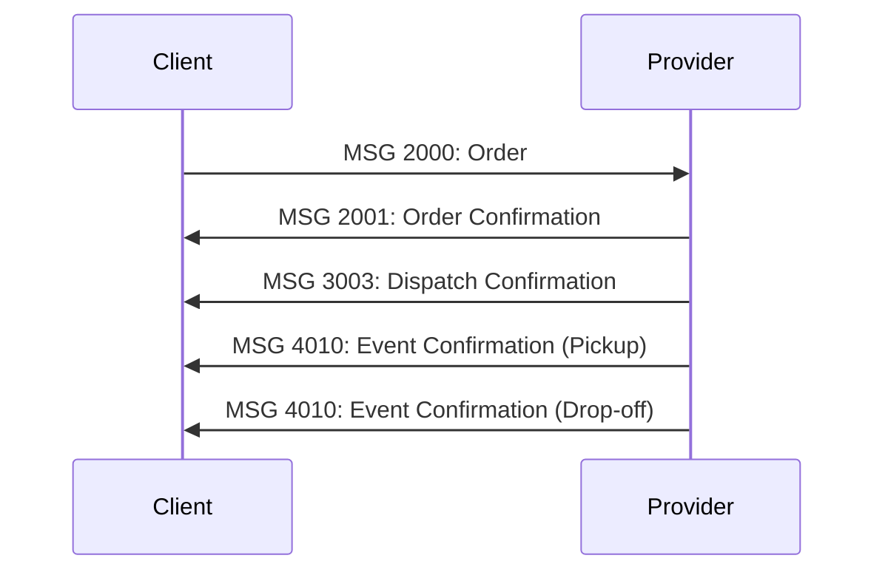

# SUTI Basics

> Core concepts, terms, and relationships in the SUTI standard

---

## Overview

This guide introduces the fundamental concepts of the SUTI standard. Understanding these terms and their relationships is essential before implementing SUTI communication between Client and Provider systems.

**Target Audience**: Developers, system architects, and technical stakeholders implementing SUTI for the first time.

---

## Table of Contents

- [Core Actors](#core-actors)
- [Messages and Communication](#messages-and-communication)
- [Transportation Domain](#transportation-domain)
- [Order Containers](#order-containers)
- [Events and Time](#events-and-time)
- [Geographic Concepts](#geographic-concepts)
- [Attributes and Resources](#attributes-and-resources)
- [Economy](#economy)
- [Data Formats](#data-formats)
- [Communication Methods](#communication-methods)
- [GDPR and Security](#gdpr-and-security)

---

## Core Actors

### Client

A **Client** needs transportation for its travellers. The transportation needs are collected in a **booking and planning system**.

**Examples**:
- Public transport authority managing DRT services
- Healthcare organization booking patient transport
- Municipality coordinating school transport
- Taxi app aggregating multiple providers

**Responsibilities**:
- Collecting travel demands
- Creating and sending orders
- Monitoring trip execution
- Managing agreements with providers

---

### Provider

A **Provider** uses Vehicles to meet transportation needs communicated from the Client system. Providers typically use a **traffic control system** for monitoring vehicles.

**Examples**:
- Taxi dispatch company
- Transport operator with vehicle fleet
- Subcontractor fulfilling specific routes
- Individual driver with vehicle

**Responsibilities**:
- Accepting and dispatching orders
- Managing vehicle fleet and drivers
- Reporting trip events
- Executing transportation

---

### Agreement

An **Agreement** is set up between the Client and one or more Providers to solve transportation needs. In public transport, agreements typically result from a **public procurement process**.

**Properties**:
- Defines business relationship
- Specifies service area
- Sets pricing terms
- Determines service levels
- May cover multiple vehicles/drivers

---

### Link

A **Link** is a SUTI communication setup between a Client system and a Provider system for a specific Agreement.

**Technical Setup**:
- One Agreement = One Link
- Unique Link ID for each connection
- HTTP endpoints configured on both sides
- Authentication credentials exchanged
- Link Mapping messages (7100/7101) establish connection

**Link Mapping Flow**:


---

## Messages and Communication

### Message

A **Message** is the fundamental communication unit in SUTI. The Client and Provider exchange Messages to fulfill needs.

**Message Structure** (XML):
```xml
<SUTI>
  <orgSender name="ClientName">
    <idOrg src="SUTI:idLink" id="client_site_001" unique="true"/>
  </orgSender>
  <orgReceiver name="ProviderName">
    <idOrg src="SUTI:idLink" id="provider_site_001" unique="true"/>
  </orgReceiver>
  <msg msgType="2000" msgName="Order">
    <idMsg src="client_site_001:idMsg" id="MSG12345" unique="true"/>
    <!-- Message content -->
  </msg>
</SUTI>
```

---

### Request and Response

- **Request**: Expresses a need in a Message
- **Response**: Action on the Request with one or more Messages

**Example**:
- **Request**: MSG 2000 (Order)
- **Response**: MSG 2001 (Order Confirmation) or MSG 2002 (Order Reject)

---

### Flow

A **Flow** is a sequence of Messages exchanging information. Each use case typically involves a specific message flow.

**Simple Order Flow**:


See [Message Flows](../message-flows/README.md) for detailed flow diagrams.

---

### Message Blocks

Message Types are identified by a **four-digit number** (msgType) and grouped into **Blocks** by domain.

| Block | Domain | Description | Examples |
|-------|--------|-------------|----------|
| **[10](../messages/block-10-resource.md)** | Dynamic Resource Utilization | Resource information, login/logout | 1020: Resource Login |
| **[20](../messages/block-20-order.md)** | Order Management | Order lifecycle | 2000: Order, 2001: Confirmation |
| **[30](../messages/block-30-dispatch.md)** | Dispatch | Vehicle assignment | 3003: Dispatch Confirmation |
| **[40](../messages/block-40-traffic.md)** | Traffic Control | Events and monitoring | 4010: Event Confirmation |
| **[50](../messages/block-50-communication.md)** | Communication | Information exchange | 5000: Info Request |
| **[60](../messages/block-60-report.md)** | Reports | Trip reports | 6001: Trip Report |
| **[70](../messages/block-70-technical.md)** | Technical Control | Link mapping, keepalive | 7000: Keep Alive |
| **[80](../messages/block-80-accounting.md)** | Accounting | Billing and invoices | 8100: Invoice |

**Pattern**: The first digit indicates the Block number (e.g., all 2xxx messages are in Block 20).

---

## Transportation Domain

### Content

**Content** is what is transported. Each transport has at least one Content.

**Content Types**:
- **Traveller** (also called Passenger) - Most common
- **Parcel** - Package delivery
- Additional specific types in [SUTI_Enumeration_values.csv](../../data/SUTI_Enumeration_values.csv)

---

### Route and Node

- **Route**: A sequence of Nodes representing the transport plan
- **Node**: A geographical place + Content + requirements for that location

**Node as Activity**:
Each Node represents an activity, not just a location. A Node includes:
- Geographic location (address/coordinates)
- Node type (Pickup, Destination, etc.)
- Content at this node
- Time requirements
- Special requirements (wheelchair access, assistance, etc.)

**Example Route**:
```
Route: [Node 1: Pickup] → [Node 2: Destination]
```

Complex routes may have many Nodes:
```
Route: [Pickup A] → [Pickup B] → [Destination A] → [Destination B]
```

---

### Node Types

**Common Node Types**:
- **Pickup**: Content enters vehicle
- **Destination**: Content exits vehicle
- **Via**: Intermediate waypoint (no content activity)

A single Content typically has:
- One Pickup Node
- One Destination Node

---

### Trip

**Trip** = Transport of a single Content from Pickup to Destination

**Important**: SUTI doesn't use "Trip" as a formal term in messages. The standard is built around **Nodes** and **Routes**. However, "Trip" is the recommended term to describe single-content transport in discussions.

---

## Order Containers

These terms describe different ways of organizing Routes.

### Order

An **Order** consists of a Route. The Route can be:
- **Static**: All Nodes defined upfront
- **Dynamic**: Nodes added progressively

**XML Structure**:
```xml
<order>
  <idOrder src="client:order" id="ORD-12345" unique="true"/>
  <agreement src="SUTI:agreement" id="AGR-001"/>
  <route>
    <node nodeType="Pickup" sequence="1">
      <!-- Node details -->
    </node>
    <node nodeType="Destination" sequence="2">
      <!-- Node details -->
    </node>
  </route>
</order>
```

---

### SubOrder

Some Orders are built from simpler orders called **SubOrders**.

**Use Case**: Multiple travellers combined into shared ride:
- SubOrder 1: Client's Order A (Pickup A → Destination A)
- SubOrder 2: Client's Order B (Pickup B → Destination B)
- Provider combines into one Order with optimized route

See [Shared Ride Flow](../message-flows/block-20-flows.md#shared-ride-flow) for details.

---

### OrderTemplate and Repetitive Orders

- **Repetitive Order**: Plan for Orders over a period (e.g., school transport)
- **OrderTemplate**: Contains Calendar and scheduled Routes for repetitive orders

**Use Case**: School bus runs Monday-Friday for 3 months
- MSG 2800: OrderTemplate defines the pattern
- MSG 2801: OrderTemplateConfirmation accepts it
- Daily orders generated automatically from template

See [Block 20 Messages](../messages/block-20-order.md#repetitive-orders) for details.

---

### DriverSession

A **DriverSession** contains Orders dynamically added during a driver's shift. Orders are assumed to be simple (Base Orders), ideally Trips.

**Characteristics**:
- Orders added in real-time
- No SubOrder references (max 2-level hierarchy)
- Represents a driver's work session
- Used for dynamic dispatch scenarios

**Use Case**: Taxi driver accepting orders throughout shift

See [DriverSession Flow](../message-flows/block-20-flows.md#driversession-flow) for details.

---

### Tour

A **Tour** represents several Nodes and Events for **accounting** between Client and Provider. May comprise several Orders performed in sequence.

**Relationship**:
- If DriverSession used → Tour likely represents one DriverSession
- Used in Block 80 (Accounting) messages
- Contains financial settlement data

---

## Events and Time

### Events

**Events** register and communicate specific activities for each Node.

**Common Event Types**:
- `1701`: Vehicle at node (`vehicleatnode`)
- `1702`: Passenger in vehicle (`invehicle`)
- `1703`: Passenger exited vehicle (`exitvehicle`)
- `1704`: No-show (`noshow`)
- `1714`: Start (trip/shift)
- `1715`: Stop (trip/shift)

**Event Message**: MSG 4010 (Event Confirmation)

**Note**: For historical reasons, Events use the `PickupConfirmation` XML tag (first Event type). The `EventType` attribute clarifies which event occurred.

**Example**:
```xml
<pickupConfirmation eventType="1702" eventName="invehicle">
  <idOrder src="client:order" id="ORD-12345" unique="true"/>
  <idContent src="client:content" id="PASS-001" unique="true"/>
  <timesEvent timeType="Actual">2025-12-30T10:15:30</timesEvent>
</pickupConfirmation>
```

Not all vehicle equipment supports all Event types.

See [Event Type List](../messages/block-40-traffic.md#event-types) for complete reference.

---

### Time Types

SUTI handles four different **TimeTypes**:

| TimeType | Description | Use Case |
|----------|-------------|----------|
| **Scheduled** | Planned time agreed with Traveller | Appointment time, meeting time |
| **Estimated** | Prognosticated time (may change) | Real-time ETA updates |
| **Actual** | Time event actually occurred | Pickup confirmation, drop-off time |
| **ASAP** | As Soon As Possible | Urgent requests, dynamic dispatch |

**Example**: Sending Events in advance with Estimated Time
```xml
<timesEvent timeType="Estimated">2025-12-30T10:20:00</timesEvent>
```

Later updated with Actual:
```xml
<timesEvent timeType="Actual">2025-12-30T10:22:15</timesEvent>
```

---

### DwellTime

**DwellTime** specifies additional time required at a Node for activities.

**Use Cases**:
- Assistance for elderly passenger (extra 5 minutes)
- Loading wheelchair (extra 3 minutes)
- Parcel delivery requiring signature

**XML Example**:
```xml
<timesNode timeType="Scheduled" dwellTime="PT5M">2025-12-30T10:00:00</timesNode>
```

---

## Geographic Concepts

### Address

Describes geographic properties of a Node. Can be expressed multiple ways.

**Address Components**:
- Street name and number
- Postal code and area
- Location (geographical area like taxi area)
- Geographic coordinates (see below)

**Minimum Requirements**: See [Section 5.1.5](establishing-link.md#addresses)

---

### Geographic Location

**Geographic Location** = Coordinates (latitude/longitude)

**Format**: WGS-84 decimal degrees

**Resolution**: See [Section 5.1.6](establishing-link.md#geographical-location)

**Example**:
```xml
<geographicLocation>
  <latitude>59.3293</latitude>
  <longitude>18.0686</longitude>
</geographicLocation>
```

---

### Location vs location

**Important Distinction**:
- **Geographic Location**: Coordinates (capital L, two words)
- **location attribute**: Geographical area (postal area, taxi area) in Address

This is an exception - "location" in all other SUTI contexts refers to geographical coordinates.

---

## Attributes and Resources

### Content Attributes

**Attributes** define restrictions/requirements for transport based on Content characteristics.

**Examples**:
- Wheelchair user
- Requires assistance
- Guide dog
- Extra luggage
- Stretcher patient

**Source**: [SUTI Attribute List](../../data/SUTI_Enumeration_values.csv)

**Self Declaration**: Essential to document which Attributes may occur in your implementation.

---

### Resource Attributes

**Resources** = Vehicle + Driver

Attributes match Content requirements:
- **Vehicle Attributes**: Wheelchair accessible, stretcher capable, cargo space
- **Driver Attributes**: Medical training, language skills, security clearance

Both have extensive attribute lists in [SUTI Attribute List](../../data/SUTI_Enumeration_values.csv).

**Matching Process**:
1. Content has Attribute requirements
2. System matches with Vehicle/Driver Attributes
3. Suitable Resource assigned to Order

See [Resource Description](establishing-link.md#resource-description) for details.

---

### Connection

A **Connection** defines when a Node depends on another transport.

**Use Cases**:
- Flight connection (pickup must arrive before flight departure)
- Train connection (drop-off after train arrival)
- Timetable-bound public transport

**Example**: Airport pickup for flight departure at 14:30
```xml
<connection>
  <connectionType>Flight</connectionType>
  <connectionId>SK1234</connectionId>
  <connectionTime>2025-12-30T14:30:00</connectionTime>
</connection>
```

---

## Economy

### Overview

Economy in SUTI comprises two main parts:
1. **Price** - Cost calculation
2. **FormOfPayment** - Payment method

---

### Price

Price allows several calculation types:

**Taximeter Setting**:
Describes how a taximeter should be set to measure transport price.

**Example**:
```xml
<price>
  <priceType>Taximeter</priceType>
  <tariffId>T1</tariffId>
</price>
```

---

### FormOfPayment

Describes how transport is paid for.

**Common Types**:

| Type | Description | Use Case |
|------|-------------|----------|
| **Cash** | Passenger pays in vehicle | Cash or card payment to driver |
| **Account** | Payment outside vehicle | Invoicing transaction, corporate account |
| **SocialServiceFee** | Passenger pays partial price | Subsidized transport, passenger co-pay |

**Example**:
```xml
<payment>
  <formOfPayment>Account</formOfPayment>
  <idEkInfo src="client:account" id="ACC-12345"/>
</payment>
```

---

## Data Formats

### XML (eXtensible Markup Language)

**Primary Format**: SUTI started with XML in 2002 and remains the dominant format.

**Advantages**:
- XML Schema (XSD) provides format specification
- Validation ensures compliance
- Modern tools support validation
- Extensive tooling ecosystem

**Validation**:
```bash
xmllint --noout --schema schemas/SUTI_Message.xsd examples/XML/2000.xml
```

See [XML Examples](../../examples/README.md) for 35+ validated examples.

---

### JSON

**Introduced**: 2021 for specific use cases

**Current Support**:
- Vehicle location updates (bulkLocation messages)
- Gradual expansion to other message types

**Future**: JSON examples will be added to documentation as support expands.

**Contact**: SUTI Technical Committee for JSON implementation guidance.

**Example** (MSG 7000 Keep Alive):
```json
{
  "SUTI_7000_keepAlive": {
    "msg": {
      "msgType": "7000",
      "msgTimeStamp": "2025-12-30T10:00:00.000",
      "orgSender": {
        "name": "ProviderName",
        "idOrg": {
          "src": "SUTI:idLink",
          "id": "provider_site_001",
          "unique": true
        }
      }
    }
  }
}
```

---

## Communication Methods

### Bidirectional Communication

SUTI uses **two-way communication**:
- Provider acts as server for Client → Provider requests
- Client acts as server for Provider → Client requests

**Important**: SUTI avoids terms "Service" and "API" as they don't express bidirectional Message Flows clearly.

---

### HTTP POST (Recommended)

**Bidirectional asynchronous HTTP POST** is the recommended method.

**Setup**:
1. Client establishes HTTPS endpoint
2. Provider establishes HTTPS endpoint
3. Both respond to HTTP POST requests

**Request Parameters**:
- `senderSutiId`: Link ID of sender
- `receiverSutiId`: Link ID of receiver
- `msgType`: Message type in body

**Security**:
- Basic Authorization
- White-listing of calling parties
- HTTPS encryption

**Example cURL** (XML):
```bash
curl --location --request POST \
  'https://provider.example.com/suti?senderSutiId=client_001&receiverSutiId=provider_001&msgType=2000' \
  --header 'Content-Type: application/xml; charset=UTF-8' \
  --header 'Authorization: Basic encoded_credentials' \
  --data-raw '<SUTI>...</SUTI>'
```

See [Communication Methods Guide](communication-methods.md) for detailed setup.

---

### Other Methods

**Port-to-Port Socket Communication**:
- Two-way IP protocol using different ports
- Often embedded in VPN
- Firewall configuration challenges

**Polling**:
- Client provides URL
- Provider polls for messages
- High communication overhead

**WebSockets**:
- Persistent connection
- Similar to port-to-port but using WebSocket protocol
- Reduces overhead

---

### Unsupported Messages

Messages not supported by either party handled with:
- **MSG 7030**: Syntax Error
- **MSG 7031**: Not operational

This informs the calling party that a Message is invalid.

---

## GDPR and Security

### Personal Data

SUTI communication may contain **personal data** under GDPR:

**Passenger Data**:
- Name, ID number
- Contact information (phone, email)
- Attributes (medical conditions, disabilities)

**Driver Data**:
- Name, ID
- Contact information

---

### Legal Responsibilities

**Parties must ensure**:
1. Legitimate interest OR consent from individuals
2. Compliance with GDPR and relevant legislation
3. Minimize personal data to what's essential

**Example**: SUTI allows calls between passenger and driver without revealing telephone numbers (privacy protection).

---

### Encryption

**Strongly Recommended**: All SUTI communication using personal data elements should be **encrypted**.

**Standard Practice**:
- HTTPS for all communication
- TLS 1.2 or higher
- Certificate validation
- Secure credential storage

See [GDPR & Security Guide](gdpr-security.md) for comprehensive requirements.

---

## Terms Out of Scope

The following terms are commonly used in transport/booking but are **outside SUTI scope**:

### Booking, Segment, Reservation

**Booking**: Travel industry term for making Reservations
**PNR** (Passenger Name Record): Common description of payer and user
**Segment**: Different types like flights or taxi trips

**SUTI Scope**: Client system handles these internally. SUTI transforms a "taxi Segment" into an Order for Provider.

---

### Fleet, Settlement, Dispatch

**Fleet**: Collection of vehicles
**Dispatch**: Provider assigns Order to Vehicle
**Settlement**: Financial settlement between Vehicle and Provider Company

**SUTI Scope**:
- Provider handles these internally
- Block 30 allows Client to reject dispatch proposals
- Order Status "dispatching" indicates Provider searching for Vehicle
- **Accounting** (Block 80) handles Client-Provider settlement (not internal Provider settlement)

---

## Quick Reference

### Core Relationships

```
Agreement → Link → Messages → Flows

Order → Route → Nodes → Content

Resource → Vehicle + Driver → Attributes

Event → Node → Time → Actual/Estimated
```

### Essential IDs

Every SUTI message contains:
- `idMsg`: Unique message ID
- `orgSender`: Sending organization
- `orgReceiver`: Receiving organization
- `idOrder`: Order ID (in order messages)

### Must-Read Next

1. **[Establishing a Link](establishing-link.md)** - How to set up SUTI connection
2. **[Message Reference](../messages/README.md)** - All message types
3. **[Message Flows](../message-flows/README.md)** - Visual flow diagrams
4. **[Use Cases](../use-cases/README.md)** - Real-world scenarios

---

## Additional Resources

- **[SUTI Messages PDF](../SUTI_Messages.pdf)** - Original 54-page specification
- **[How to use SUTI PDF](../How%20to%20use%20SUTI.pdf)** - Complete 170-page guide
- **[XML Schema](../../schemas/SUTI_Message.xsd)** - XSD validation schema
- **[Enumeration List](../../data/SUTI_Enumeration_values.csv)** - All standard attribute values

---

[← Back to Getting Started](README.md) | [Establishing a Link →](establishing-link.md)
