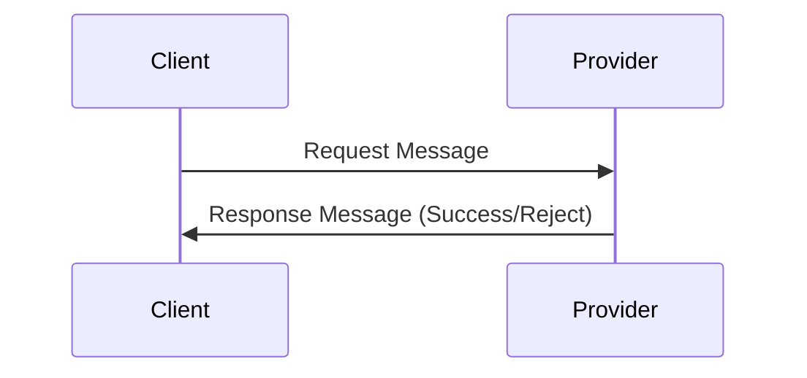
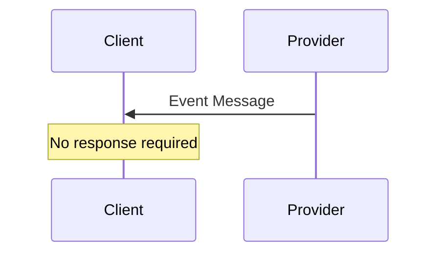
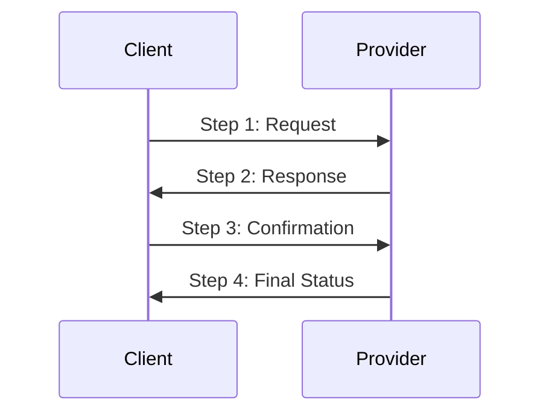
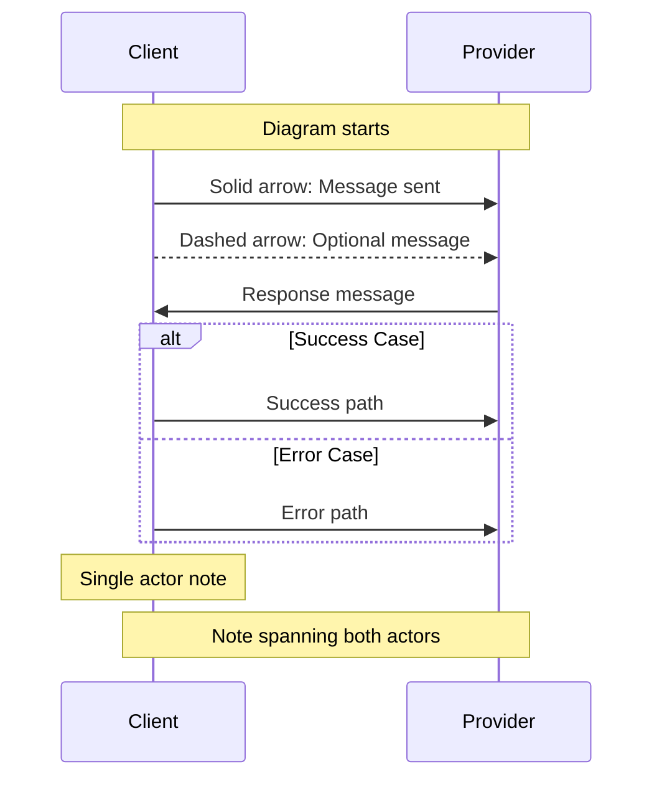
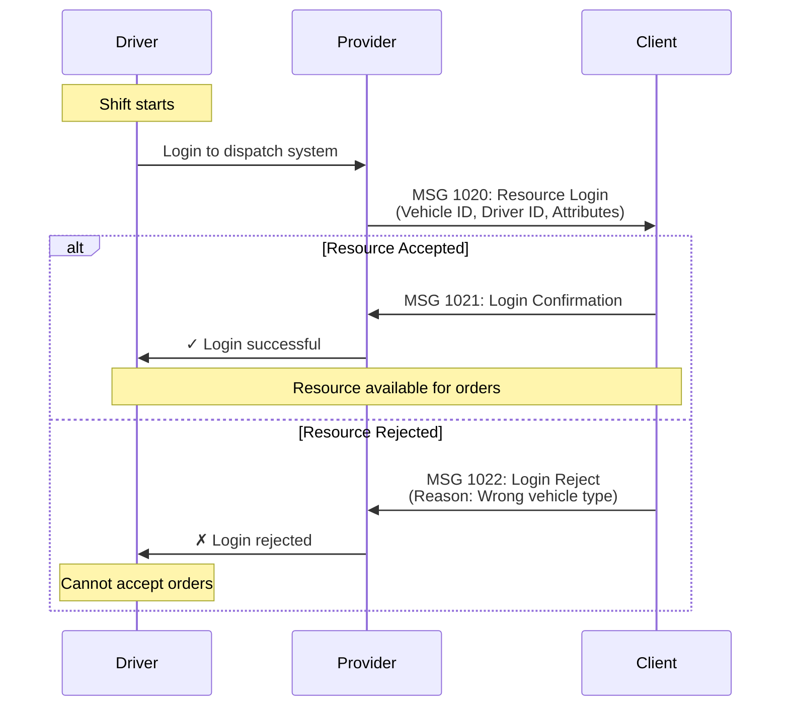

# SUTI Message Flows

> Visual sequence diagrams showing message interactions between Client and Provider

---

## Overview

This section provides **visual representations** of how SUTI messages flow between actors during different scenarios. Each flow diagram uses [Mermaid](https://mermaid.js.github.io/) syntax for interactive, version-controllable diagrams.

---

## Flow Diagrams by Block

| Block | Title | Status | Documentation |
|-------|-------|--------|---------------|
| **[10](block-10-flows.md)** | Dynamic Resource Utilization | ✅ Complete | Resource login, requests, ratings |
| **[20](block-20-flows.md)** | Order Management | ✅ Complete | Order lifecycle flows |
| **[30](block-30-flows.md)** | Dispatch | 📋 Planned | Dispatch operations |
| **[40](block-40-flows.md)** | Traffic Control | 📋 Planned | Event flows |
| **[50](block-50-flows.md)** | Communication | 📋 Planned | Information exchange |
| **[60](block-60-flows.md)** | Reports | 📋 Planned | Reporting flows |
| **[70](block-70-flows.md)** | Technical Control | 📋 Planned | Link mapping |
| **[80](block-80-flows.md)** | Accounting | 📋 Planned | Billing flows |

---

## Common Flow Patterns

### Request-Response Pattern

Most SUTI messages follow a request-response pattern:

**Examples**:
- Resource Request (1000) → Resource Response (1010)
- Order (2000) → Order Confirmation (2001) or Order Reject (2002)

### Event Notification Pattern

Some messages are one-way event notifications:

**Examples**:
- Traffic events (MSG 4010-4012)
- Trip reports (MSG 6001)

### Multi-Step Flows

Complex scenarios involve multiple message exchanges:

**Examples**:
- Order cancellation workflows
- DriverSession management

---

## Quick Navigation

### By Use Case

**Setting Up**
- [Resource Login Flow](block-10-flows.md#resource-login-sequence)
- [Link Mapping](block-70-flows.md#link-mapping-flow)

**Order Management**
- [Basic Order Flow](block-20-flows.md#basic-order-flow)
- [Order Cancellation](block-20-flows.md#order-cancellation-flow)
- [DriverSession Flow](block-20-flows.md#driversession-flow)

**During Transport**
- [Traffic Events](block-40-flows.md#event-confirmation-flow)
- [Pickup/Drop-off](block-40-flows.md#pickup-dropoff-sequence)

**After Transport**
- [Trip Reporting](block-60-flows.md#trip-report-flow)
- [Invoicing](block-80-flows.md#invoice-flow)

---

## Understanding Mermaid Diagrams

### Diagram Elements

### Symbol Legend

| Symbol | Meaning |
|--------|---------|
| `->>` | Message sent (synchronous) |
| `-->>` | Optional/async message |
| `alt/else` | Alternative paths |
| `opt` | Optional step |
| `loop` | Repeated action |
| `par` | Parallel execution |
| `Note` | Explanatory note |

---

## Interactive Diagrams

Mermaid diagrams on GitHub are **interactive**:
- Click to expand
- Zoom in/out
- Pan around large diagrams
- Copy diagram source

---

## Viewing Flows

### On GitHub
GitHub natively renders Mermaid diagrams in Markdown files. Simply view the flow files on GitHub.

### In VS Code
Install the [Mermaid Preview](https://marketplace.visualstudio.com/items?itemName=vstirbu.vscode-mermaid-preview) extension.

### In Browser
Use [Mermaid Live Editor](https://mermaid.live/) to view and edit diagrams.

### Export Options
- **PNG**: Screenshot rendered diagram
- **SVG**: Export as vector graphics
- **Markdown**: Copy source code

---

## Example: Complete Resource Login Flow

---

## Flow Documentation Structure

Each block's flow documentation includes:

1. **Overview**: Block purpose and key flows
2. **Message Sequences**: Visual diagrams
3. **Flow Descriptions**: Text explanation of each flow
4. **Use Cases**: When to use each flow
5. **Error Handling**: Exception paths
6. **Examples**: Links to XML examples

---

## Additional Resources

- **[SUTI Message Flow PDF](../SUTI_Message_Flow.pdf)** - Original diagrams (12 pages)
- **[Message Reference](../messages/README.md)** - Complete message specifications
- **[Use Cases](../use-cases/README.md)** - Real-world implementation scenarios
- **[Mermaid Documentation](https://mermaid.js.github.io/)** - Diagram syntax reference

---

## Contributing Flows

Want to add or improve a flow diagram?

1. Use [Mermaid Live Editor](https://mermaid.live/) to create/test diagram
2. Copy Mermaid syntax
3. Add to appropriate block flow file
4. Submit pull request

---

[← Back to Documentation Hub](../README.md) | [View Messages →](../messages/README.md)
