# Block 10: Dynamic Resource Utilization Flows

> Message sequence diagrams for resource management operations

---

## Overview

Block 10 flows handle dynamic resource allocation between Client and Provider, including:
- Resource requests and responses
- Resource login and logout
- Rating exchanges
- Node and price list requests

---

## Message Flows

### Resource Request/Response Sequence

#### Single Resource Request

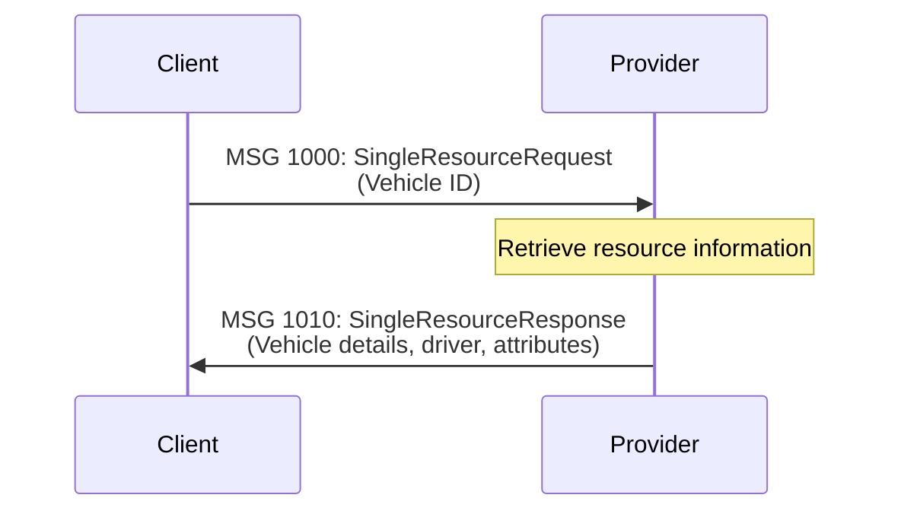
```mermaid
sequenceDiagram
    participant C as Client
    participant P as Provider

    C->>P: MSG 1000: SingleResourceRequest<br/>(Vehicle ID)
    Note over P: Retrieve resource information
    P->>C: MSG 1010: SingleResourceResponse<br/>(Vehicle details, driver, attributes)
```

**Use Case**: Client needs information about a specific vehicle.

---

#### Agreement Resources Request

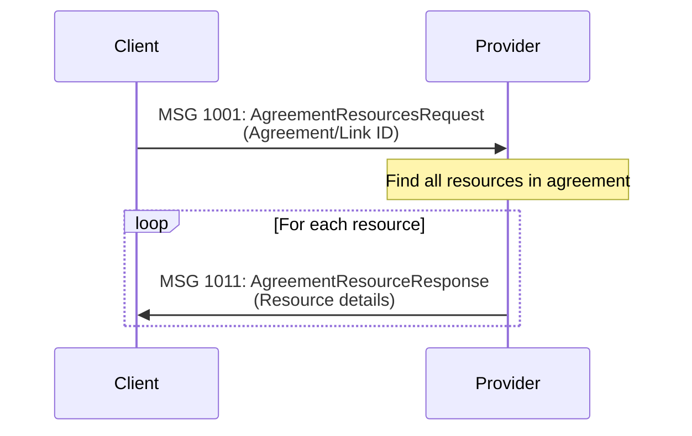
```mermaid
sequenceDiagram
    participant C as Client
    participant P as Provider

    C->>P: MSG 1001: AgreementResourcesRequest<br/>(Agreement/Link ID)
    Note over P: Find all resources in agreement

    loop For each resource
        P->>C: MSG 1011: AgreementResourceResponse<br/>(Resource details)
    end
```

**Use Case**: Client requests all vehicles associated with a specific contract/agreement.

---

#### All Resources Request

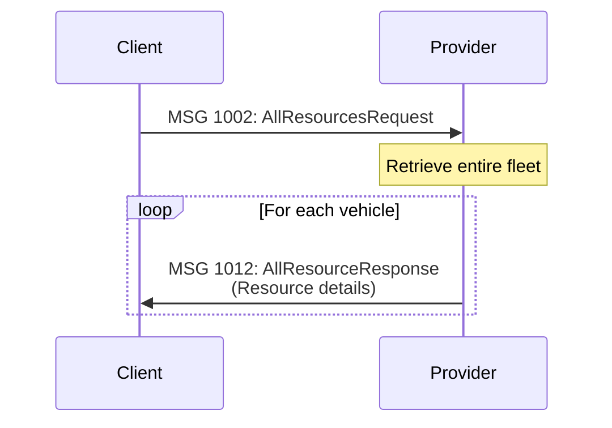
```mermaid
sequenceDiagram
    participant C as Client
    participant P as Provider

    C->>P: MSG 1002: AllResourcesRequest
    Note over P: Retrieve entire fleet

    loop For each vehicle
        P->>C: MSG 1012: AllResourceResponse<br/>(Resource details)
    end
```

**Use Case**: Client needs complete inventory of Provider's fleet.

---

### Resource Login Sequence

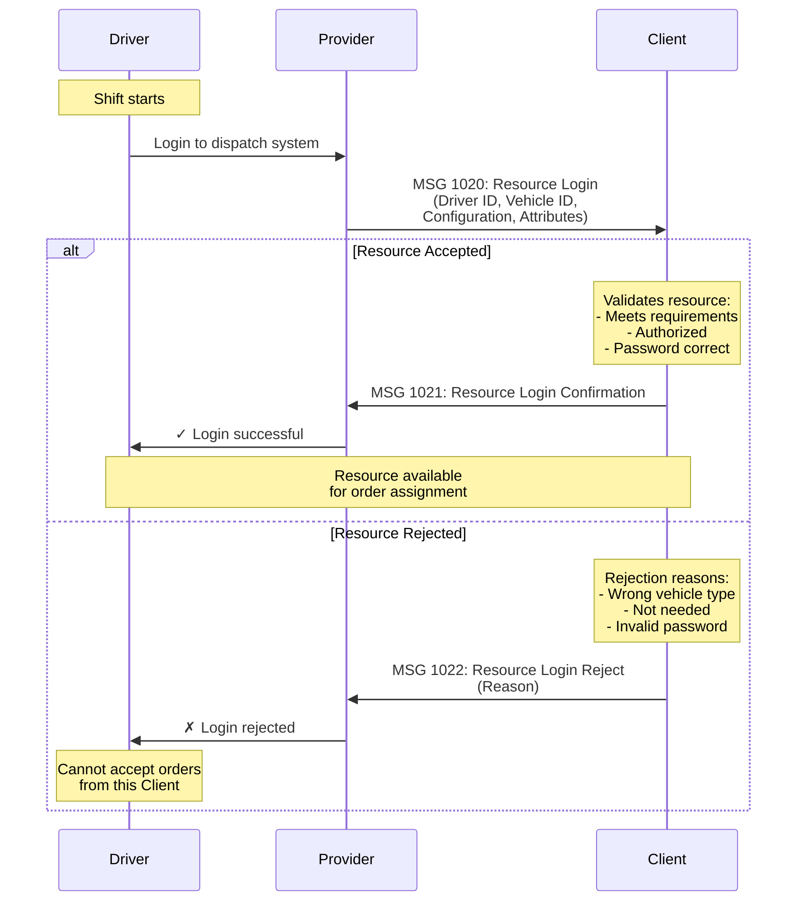
```mermaid
sequenceDiagram
    participant Driver
    participant P as Provider
    participant C as Client

    Note over Driver: Shift starts

    Driver->>P: Login to dispatch system
    P->>C: MSG 1020: Resource Login<br/>(Driver ID, Vehicle ID,<br/>Configuration, Attributes)

    alt Resource Accepted
        Note over C: Validates resource:<br/>- Meets requirements<br/>- Authorized<br/>- Password correct
        C->>P: MSG 1021: Resource Login Confirmation
        P->>Driver: ✓ Login successful
        Note over Driver,C: Resource available<br/>for order assignment

    else Resource Rejected
        Note over C: Rejection reasons:<br/>- Wrong vehicle type<br/>- Not needed<br/>- Invalid password
        C->>P: MSG 1022: Resource Login Reject<br/>(Reason)
        P->>Driver: ✗ Login rejected
        Note over Driver: Cannot accept orders<br/>from this Client
    end
```

**Use Cases**:
- Driver starts work shift
- Vehicle returns to service after maintenance
- Temporary vehicle added to fleet

**XML Examples**:
- [1020.xml](../../examples/XML/1020.xml) - Resource Login
- [1021.xml](../../examples/XML/1021.xml) - Login Confirmation
- [1022.xml](../../examples/XML/1022.xml) - Login Rejection

---

### Resource Logoff Sequence

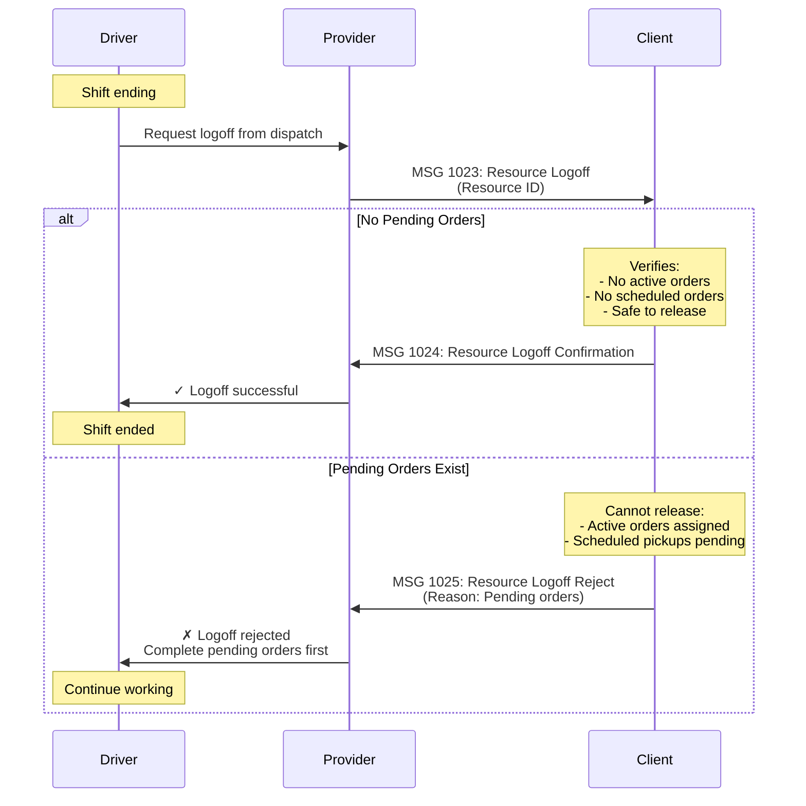
```mermaid
sequenceDiagram
    participant Driver
    participant P as Provider
    participant C as Client

    Note over Driver: Shift ending

    Driver->>P: Request logoff from dispatch
    P->>C: MSG 1023: Resource Logoff<br/>(Resource ID)

    alt No Pending Orders
        Note over C: Verifies:<br/>- No active orders<br/>- No scheduled orders<br/>- Safe to release
        C->>P: MSG 1024: Resource Logoff Confirmation
        P->>Driver: ✓ Logoff successful
        Note over Driver: Shift ended

    else Pending Orders Exist
        Note over C: Cannot release:<br/>- Active orders assigned<br/>- Scheduled pickups pending
        C->>P: MSG 1025: Resource Logoff Reject<br/>(Reason: Pending orders)
        P->>Driver: ✗ Logoff rejected<br/>Complete pending orders first
        Note over Driver: Continue working
    end
```

**Use Cases**:
- Driver ends work shift
- Vehicle taken out of service
- Emergency logoff (with force flag)

**XML Examples**:
- [1023.xml](../../examples/XML/1023.xml) - Resource Logoff

**Error Handling**:
- If Client rejects logoff, Provider should inform driver
- Driver must complete pending orders before retry
- Emergency logoff may require supervisor override

---

### Rating Exchange Flow

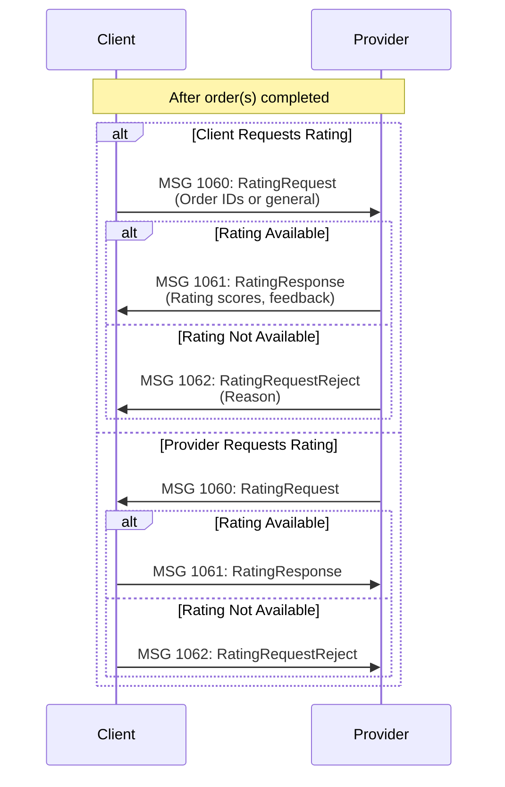
```mermaid
sequenceDiagram
    participant C as Client
    participant P as Provider

    Note over C,P: After order(s) completed

    alt Client Requests Rating
        C->>P: MSG 1060: RatingRequest<br/>(Order IDs or general)

        alt Rating Available
            P->>C: MSG 1061: RatingResponse<br/>(Rating scores, feedback)
        else Rating Not Available
            P->>C: MSG 1062: RatingRequestReject<br/>(Reason)
        end

    else Provider Requests Rating
        P->>C: MSG 1060: RatingRequest

        alt Rating Available
            C->>P: MSG 1061: RatingResponse
        else Rating Not Available
            C->>P: MSG 1062: RatingRequestReject
        end
    end
```

**Use Cases**:
- Client requests driver rating for quality monitoring
- Provider requests passenger feedback
- Average ratings for multiple orders
- Specific order rating

**Note**: MSG 1060 in Block 10 concerns multiple orders or averages. MSG 6060 in Block 60 concerns a specific finished order.

---

### Bulk Location Request Flow

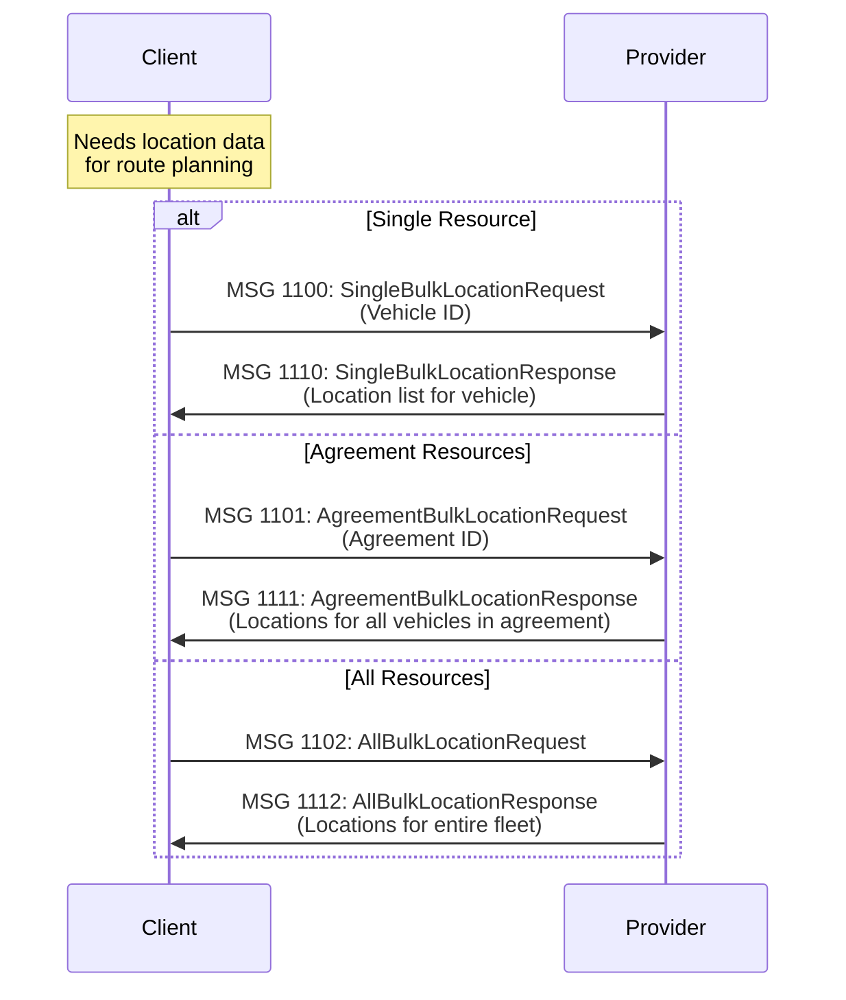
```mermaid
sequenceDiagram
    participant C as Client
    participant P as Provider

    Note over C: Needs location data<br/>for route planning

    alt Single Resource
        C->>P: MSG 1100: SingleBulkLocationRequest<br/>(Vehicle ID)
        P->>C: MSG 1110: SingleBulkLocationResponse<br/>(Location list for vehicle)

    else Agreement Resources
        C->>P: MSG 1101: AgreementBulkLocationRequest<br/>(Agreement ID)
        P->>C: MSG 1111: AgreementBulkLocationResponse<br/>(Locations for all vehicles in agreement)

    else All Resources
        C->>P: MSG 1102: AllBulkLocationRequest
        P->>C: MSG 1112: AllBulkLocationResponse<br/>(Locations for entire fleet)
    end
```

**Use Cases**:
- Client planning routes needs available pickup locations
- Bulk location data for geographic optimization
- Fleet position overview

---

### Node and Price List Exchange

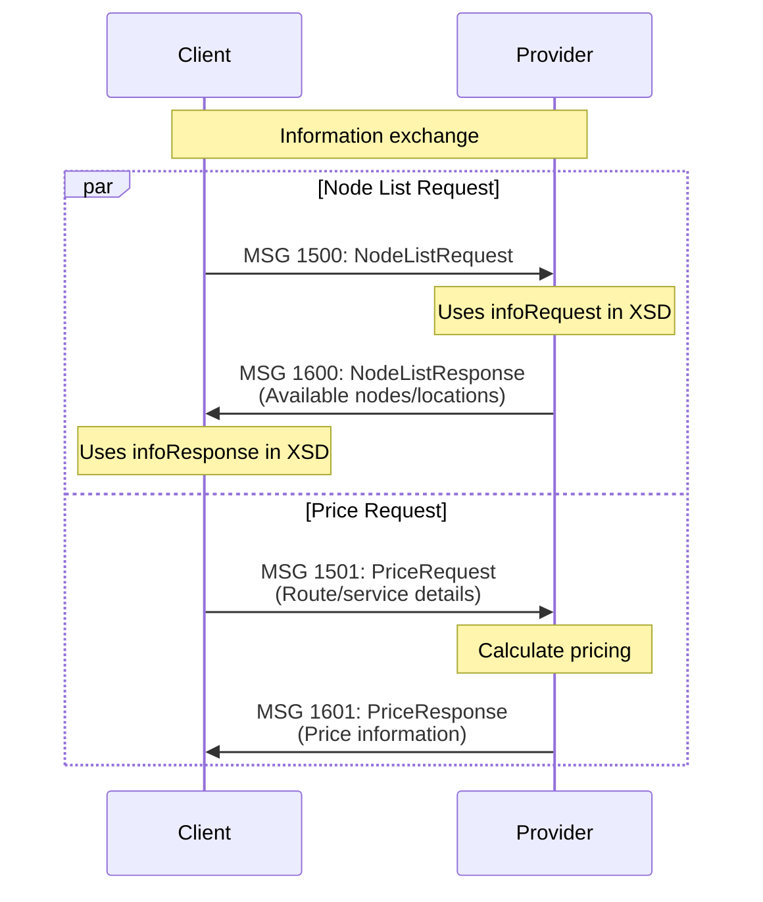
```mermaid
sequenceDiagram
    participant C as Client
    participant P as Provider

    Note over C,P: Information exchange

    par Node List Request
        C->>P: MSG 1500: NodeListRequest
        Note over P: Uses infoRequest in XSD
        P->>C: MSG 1600: NodeListResponse<br/>(Available nodes/locations)
        Note over C: Uses infoResponse in XSD
    and Price Request
        C->>P: MSG 1501: PriceRequest<br/>(Route/service details)
        Note over P: Calculate pricing
        P->>C: MSG 1601: PriceResponse<br/>(Price information)
    end
```

**Use Cases**:
- Client requests available pickup/dropoff locations
- Client requests pricing for route planning
- Initial setup: exchanging service area information

**Implementation Notes**:
- MSG 1500/1600 use `infoRequest`/`infoResponse` elements in XSD
- MSG 1501/1601 use `infoRequest`/`infoResponse` elements in XSD
- Can be exchanged in parallel for efficiency

---

### Resource Allocation Flow

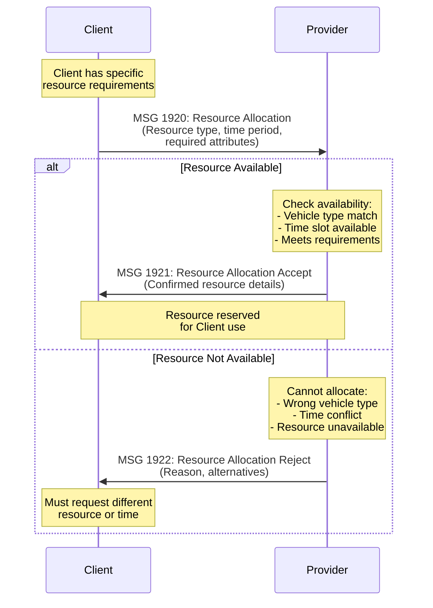
```mermaid
sequenceDiagram
    participant C as Client
    participant P as Provider

    Note over C: Client has specific<br/>resource requirements

    C->>P: MSG 1920: Resource Allocation<br/>(Resource type, time period,<br/>required attributes)

    alt Resource Available
        Note over P: Check availability:<br/>- Vehicle type match<br/>- Time slot available<br/>- Meets requirements
        P->>C: MSG 1921: Resource Allocation Accept<br/>(Confirmed resource details)
        Note over C,P: Resource reserved<br/>for Client use

    else Resource Not Available
        Note over P: Cannot allocate:<br/>- Wrong vehicle type<br/>- Time conflict<br/>- Resource unavailable
        P->>C: MSG 1922: Resource Allocation Reject<br/>(Reason, alternatives)
        Note over C: Must request different<br/>resource or time
    end
```

**Use Cases**:
- Pre-allocating resources for scheduled services
- Requesting specific vehicle types (wheelchair accessible, large capacity)
- Peak hour resource reservation

---

## Complete Flow Example: Shift Start to First Order

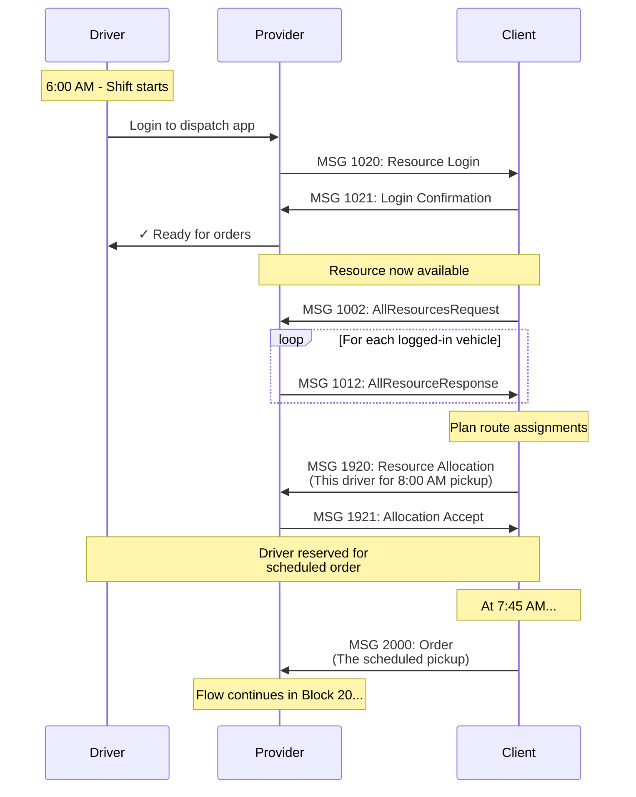
```mermaid
sequenceDiagram
    participant Driver
    participant P as Provider
    participant C as Client

    Note over Driver: 6:00 AM - Shift starts

    %% Login sequence
    Driver->>P: Login to dispatch app
    P->>C: MSG 1020: Resource Login
    C->>P: MSG 1021: Login Confirmation
    P->>Driver: ✓ Ready for orders

    Note over C,P: Resource now available

    %% Client checks fleet status
    C->>P: MSG 1002: AllResourcesRequest
    loop For each logged-in vehicle
        P->>C: MSG 1012: AllResourceResponse
    end

    Note over C: Plan route assignments

    %% Resource allocation for scheduled order
    C->>P: MSG 1920: Resource Allocation<br/>(This driver for 8:00 AM pickup)
    P->>C: MSG 1921: Allocation Accept

    Note over Driver,C: Driver reserved for<br/>scheduled order

    Note over C: At 7:45 AM...
    C->>P: MSG 2000: Order<br/>(The scheduled pickup)

    Note over P: Flow continues in Block 20...
```

---

## Flow Variations

### Multiple Logins

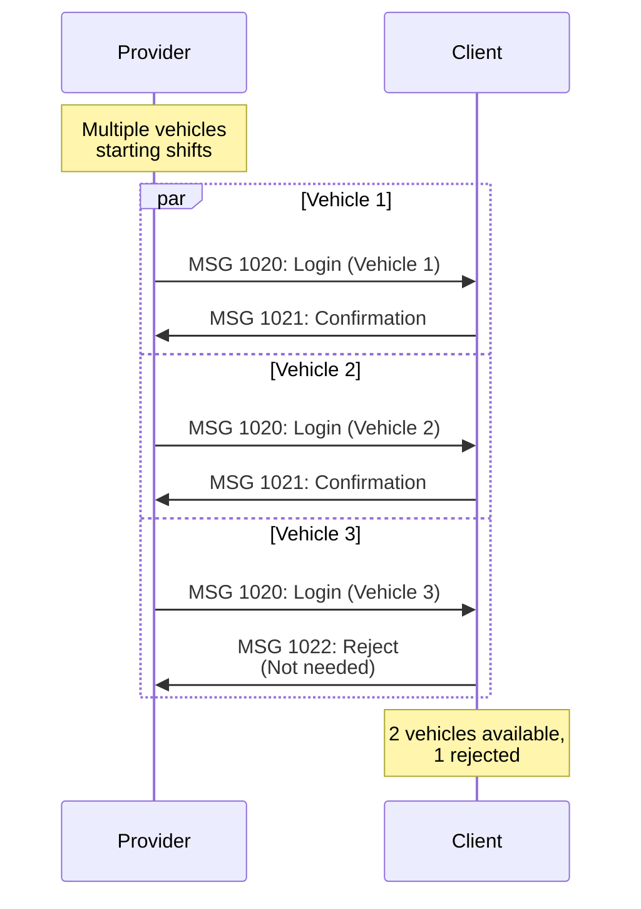
```mermaid
sequenceDiagram
    participant P as Provider
    participant C as Client

    Note over P: Multiple vehicles<br/>starting shifts

    par Vehicle 1
        P->>C: MSG 1020: Login (Vehicle 1)
        C->>P: MSG 1021: Confirmation
    and Vehicle 2
        P->>C: MSG 1020: Login (Vehicle 2)
        C->>P: MSG 1021: Confirmation
    and Vehicle 3
        P->>C: MSG 1020: Login (Vehicle 3)
        C->>P: MSG 1022: Reject<br/>(Not needed)
    end

    Note over C: 2 vehicles available,<br/>1 rejected
```

### Emergency Logoff

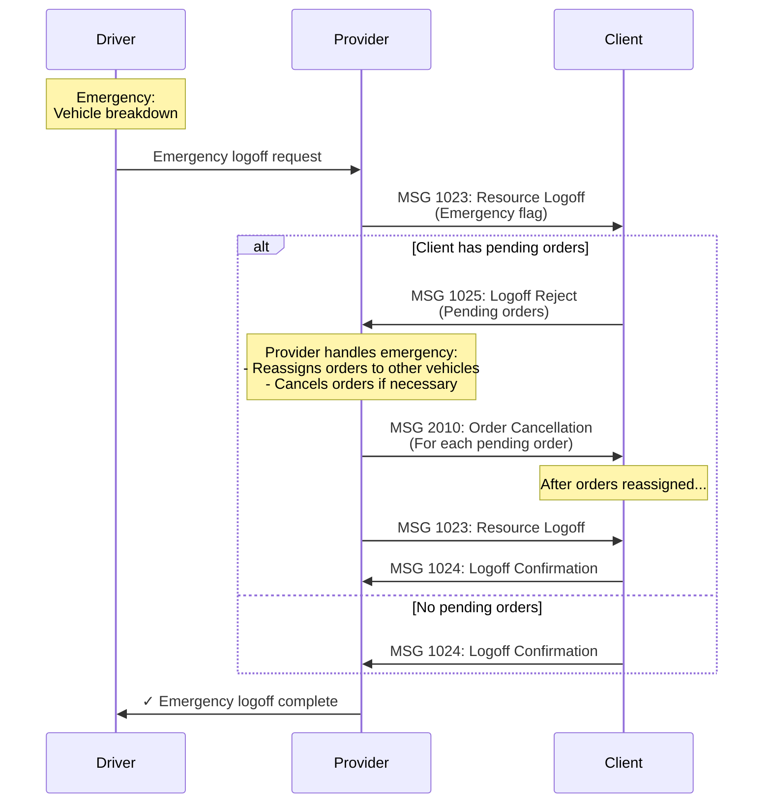
```mermaid
sequenceDiagram
    participant Driver
    participant P as Provider
    participant C as Client

    Note over Driver: Emergency:<br/>Vehicle breakdown

    Driver->>P: Emergency logoff request
    P->>C: MSG 1023: Resource Logoff<br/>(Emergency flag)

    alt Client has pending orders
        C->>P: MSG 1025: Logoff Reject<br/>(Pending orders)

        Note over P: Provider handles emergency:<br/>- Reassigns orders to other vehicles<br/>- Cancels orders if necessary

        P->>C: MSG 2010: Order Cancellation<br/>(For each pending order)

        Note over C: After orders reassigned...

        P->>C: MSG 1023: Resource Logoff
        C->>P: MSG 1024: Logoff Confirmation
    else No pending orders
        C->>P: MSG 1024: Logoff Confirmation
    end

    P->>Driver: ✓ Emergency logoff complete
```

---

## Implementation Best Practices

### Login Handling
1. **Validate immediately**: Check resource meets requirements before confirming
2. **Provide reasons**: Always explain rejections clearly
3. **Log attempts**: Track login attempts for audit
4. **Handle duplicates**: Prevent double-login of same resource

### Logoff Handling
1. **Check thoroughly**: Verify no pending orders before confirming
2. **Grace period**: Allow time for final order completion
3. **Emergency process**: Have override procedure for emergencies
4. **Notify driver**: Inform if logoff rejected and why

### Rating Exchange
1. **Timing**: Request ratings after service completion
2. **Aggregation**: Use Block 10 for multiple order averages
3. **Privacy**: Anonymize individual feedback appropriately
4. **Actionable**: Provide context with ratings

---

## Error Scenarios

### Login Rejected - Wrong Vehicle Type

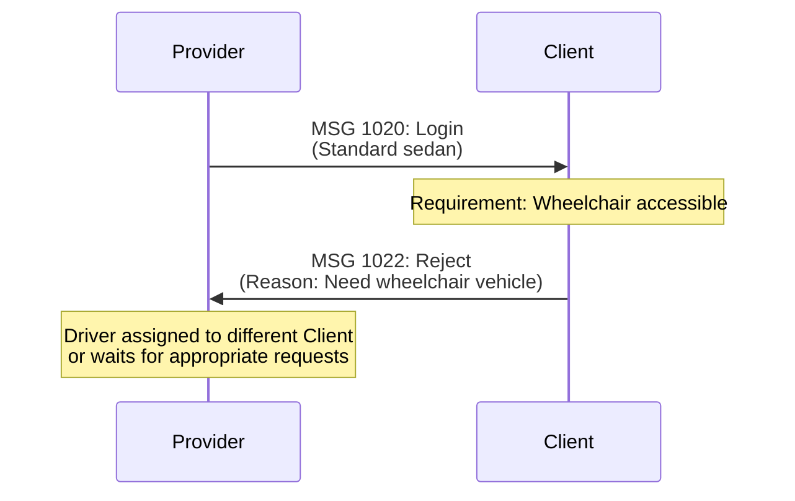
```mermaid
sequenceDiagram
    participant P as Provider
    participant C as Client

    P->>C: MSG 1020: Login<br/>(Standard sedan)
    Note over C: Requirement: Wheelchair accessible
    C->>P: MSG 1022: Reject<br/>(Reason: Need wheelchair vehicle)
    Note over P: Driver assigned to different Client<br/>or waits for appropriate requests
```

### Logoff Blocked - Active Order

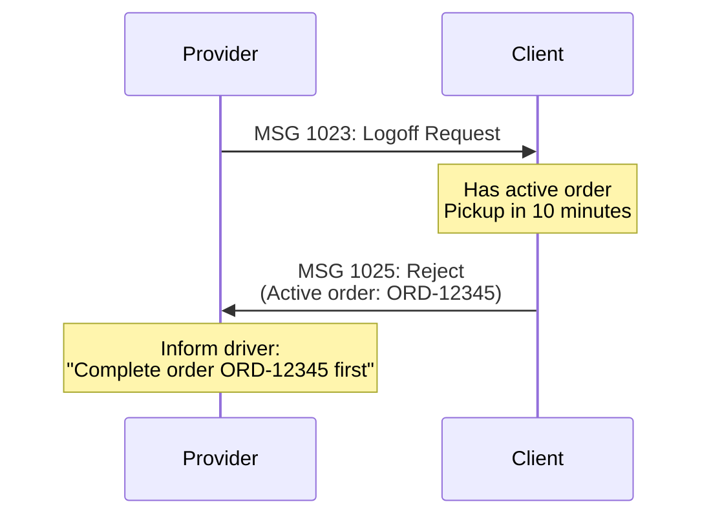
```mermaid
sequenceDiagram
    participant P as Provider
    participant C as Client

    P->>C: MSG 1023: Logoff Request
    Note over C: Has active order<br/>Pickup in 10 minutes
    C->>P: MSG 1025: Reject<br/>(Active order: ORD-12345)
    Note over P: Inform driver:<br/>"Complete order ORD-12345 first"
```

---

## Additional Resources

- **[Block 10 Messages](../messages/block-10-resource.md)** - Detailed message specifications
- **[XML Examples](../../examples/README.md#block-10-dynamic-resource-utilization)** - Validated examples
- **[Message Flow PDF](../SUTI_Message_Flow.pdf)** - Original diagrams

---

[← Flow Index](README.md) | [Block 20 Flows →](block-20-flows.md)
