# Block 20: Order Management Flows

> Message sequences for the complete order lifecycle

---

## Overview

Block 20 is the **most critical block** in SUTI, handling the entire order lifecycle from creation through completion. These flows demonstrate how orders are created, modified, cancelled, and managed between Client and Provider.

---

## Core Order Flows

### Basic Order Flow

The fundamental order creation and confirmation sequence:

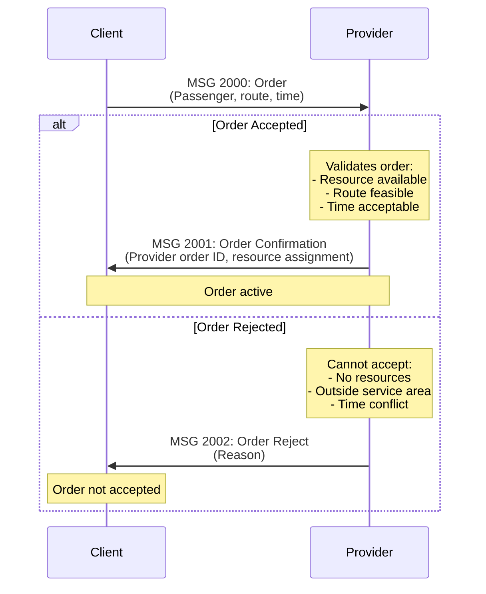
```mermaid
sequenceDiagram
    participant C as Client
    participant P as Provider

    C->>P: MSG 2000: Order<br/>(Passenger, route, time)

    alt Order Accepted
        Note over P: Validates order:<br/>- Resource available<br/>- Route feasible<br/>- Time acceptable
        P->>C: MSG 2001: Order Confirmation<br/>(Provider order ID, resource assignment)
        Note over C,P: Order active
    else Order Rejected
        Note over P: Cannot accept:<br/>- No resources<br/>- Outside service area<br/>- Time conflict
        P->>C: MSG 2002: Order Reject<br/>(Reason)
        Note over C: Order not accepted
    end
```

**XML Examples**:
- [2000.xml](../../examples/XML/2000.xml) - Basic order
- [2001.xml](../../examples/XML/2001.xml) - Order confirmation

**Use Cases**:
- Passenger books transport
- Client creates order for scheduled service
- Real-time booking request

---

### Order Reject Handling Flow

When Provider rejects an order, Client can challenge the rejection:

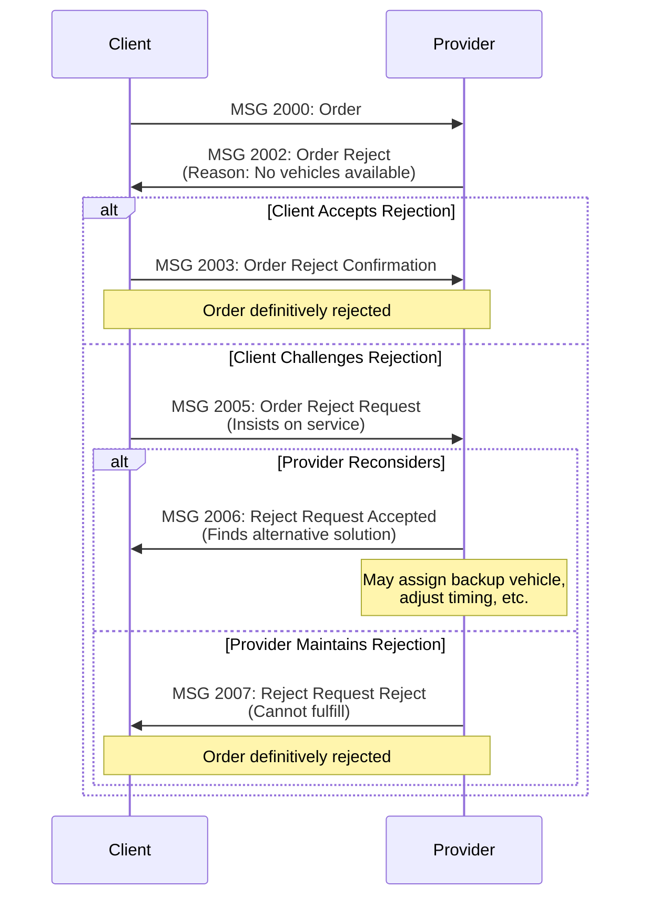
```mermaid
sequenceDiagram
    participant C as Client
    participant P as Provider

    C->>P: MSG 2000: Order
    P->>C: MSG 2002: Order Reject<br/>(Reason: No vehicles available)

    alt Client Accepts Rejection
        C->>P: MSG 2003: Order Reject Confirmation
        Note over C,P: Order definitively rejected

    else Client Challenges Rejection
        C->>P: MSG 2005: Order Reject Request<br/>(Insists on service)

        alt Provider Reconsiders
            P->>C: MSG 2006: Reject Request Accepted<br/>(Finds alternative solution)
            Note over P: May assign backup vehicle,<br/>adjust timing, etc.
        else Provider Maintains Rejection
            P->>C: MSG 2007: Reject Request Reject<br/>(Cannot fulfill)
            Note over C,P: Order definitively rejected
        end
    end
```

**Use Cases**:
- Client disputes rejection
- Client escalates important order
- Contractual obligation enforcement

---

### Order Cancellation Flow

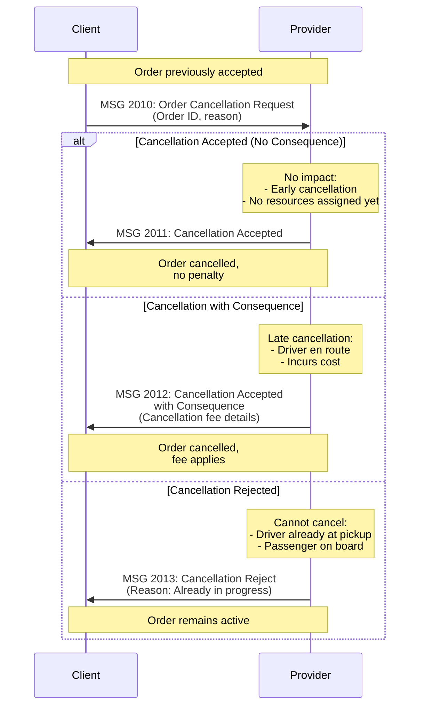
```mermaid
sequenceDiagram
    participant C as Client
    participant P as Provider

    Note over C,P: Order previously accepted

    C->>P: MSG 2010: Order Cancellation Request<br/>(Order ID, reason)

    alt Cancellation Accepted (No Consequence)
        Note over P: No impact:<br/>- Early cancellation<br/>- No resources assigned yet
        P->>C: MSG 2011: Cancellation Accepted
        Note over C,P: Order cancelled,<br/>no penalty

    else Cancellation with Consequence
        Note over P: Late cancellation:<br/>- Driver en route<br/>- Incurs cost
        P->>C: MSG 2012: Cancellation Accepted<br/>with Consequence<br/>(Cancellation fee details)
        Note over C,P: Order cancelled,<br/>fee applies

    else Cancellation Rejected
        Note over P: Cannot cancel:<br/>- Driver already at pickup<br/>- Passenger on board
        P->>C: MSG 2013: Cancellation Reject<br/>(Reason: Already in progress)
        Note over C,P: Order remains active
    end
```

**XML Examples**:
- [2010.xml](../../examples/XML/2010.xml) - Cancellation request
- [2011.xml](../../examples/XML/2011.xml) - Cancellation accepted

**Use Cases**:
- Passenger cancels booking
- Client cancels due to changed plans
- Emergency cancellation

---

### Node Cancellation Flow

Cancel part of a multi-stop order without cancelling the entire trip:

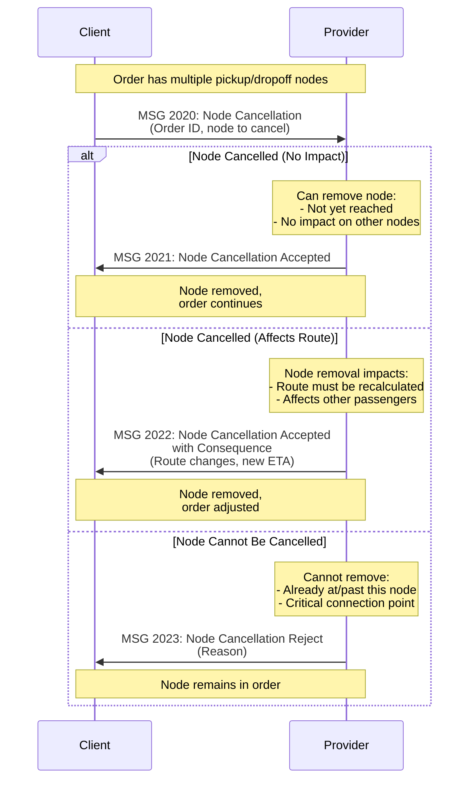
```mermaid
sequenceDiagram
    participant C as Client
    participant P as Provider

    Note over C,P: Order has multiple pickup/dropoff nodes

    C->>P: MSG 2020: Node Cancellation<br/>(Order ID, node to cancel)

    alt Node Cancelled (No Impact)
        Note over P: Can remove node:<br/>- Not yet reached<br/>- No impact on other nodes
        P->>C: MSG 2021: Node Cancellation Accepted
        Note over C,P: Node removed,<br/>order continues

    else Node Cancelled (Affects Route)
        Note over P: Node removal impacts:<br/>- Route must be recalculated<br/>- Affects other passengers
        P->>C: MSG 2022: Node Cancellation Accepted<br/>with Consequence<br/>(Route changes, new ETA)
        Note over C,P: Node removed,<br/>order adjusted

    else Node Cannot Be Cancelled
        Note over P: Cannot remove:<br/>- Already at/past this node<br/>- Critical connection point
        P->>C: MSG 2023: Node Cancellation Reject<br/>(Reason)
        Note over C,P: Node remains in order
    end
```

**Use Cases**:
- Passenger at one pickup point no-shows
- Client removes stop from shared ride
- Route optimization removes unnecessary stop

---

### Order Forwarding Flow

Transfer an order from one Provider to another:

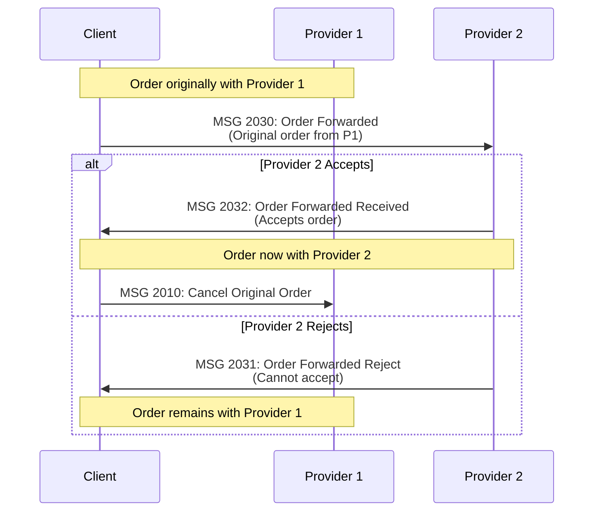
```mermaid
sequenceDiagram
    participant C as Client
    participant P1 as Provider 1
    participant P2 as Provider 2

    Note over C,P1: Order originally with Provider 1

    C->>P2: MSG 2030: Order Forwarded<br/>(Original order from P1)

    alt Provider 2 Accepts
        P2->>C: MSG 2032: Order Forwarded Received<br/>(Accepts order)
        Note over C,P2: Order now with Provider 2

        C->>P1: MSG 2010: Cancel Original Order

    else Provider 2 Rejects
        P2->>C: MSG 2031: Order Forwarded Reject<br/>(Cannot accept)
        Note over C,P1: Order remains with Provider 1
    end
```

**Use Cases**:
- Original Provider cannot fulfill (vehicle breakdown)
- Load balancing between providers
- Subcontracting to specialized provider

---

### Order Linking Flow

Link multiple orders together for coordination:

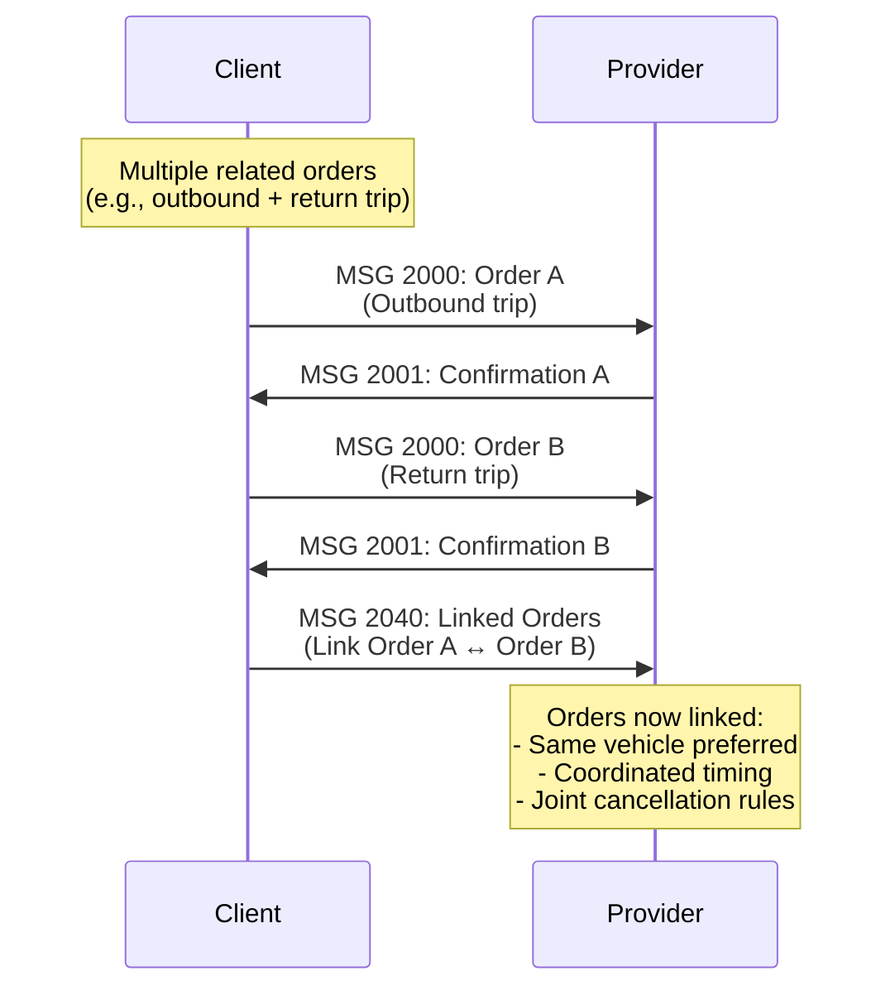
```mermaid
sequenceDiagram
    participant C as Client
    participant P as Provider

    Note over C: Multiple related orders<br/>(e.g., outbound + return trip)

    C->>P: MSG 2000: Order A<br/>(Outbound trip)
    P->>C: MSG 2001: Confirmation A

    C->>P: MSG 2000: Order B<br/>(Return trip)
    P->>C: MSG 2001: Confirmation B

    C->>P: MSG 2040: Linked Orders<br/>(Link Order A ↔ Order B)

    Note over P: Orders now linked:<br/>- Same vehicle preferred<br/>- Coordinated timing<br/>- Joint cancellation rules
```

**Use Cases**:
- Round-trip bookings
- Escort services (there and back)
- Recurring appointments

---

### Order Freeze Flow

Temporarily freeze an order to prevent modifications:

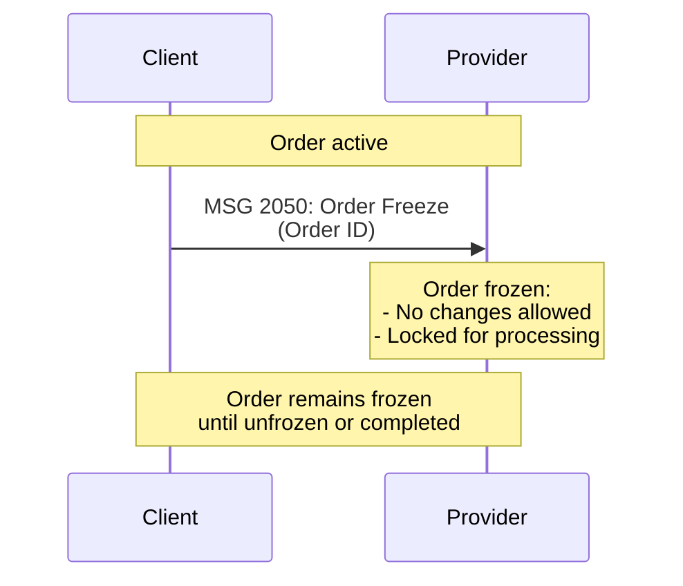
```mermaid
sequenceDiagram
    participant C as Client
    participant P as Provider

    Note over C,P: Order active

    C->>P: MSG 2050: Order Freeze<br/>(Order ID)

    Note over P: Order frozen:<br/>- No changes allowed<br/>- Locked for processing

    Note over C,P: Order remains frozen<br/>until unfrozen or completed
```

**Use Cases**:
- Lock order during payment processing
- Prevent changes during dispatch
- Administrative hold

---

### Provider Update Order Flow

Provider proposes changes to an existing order:

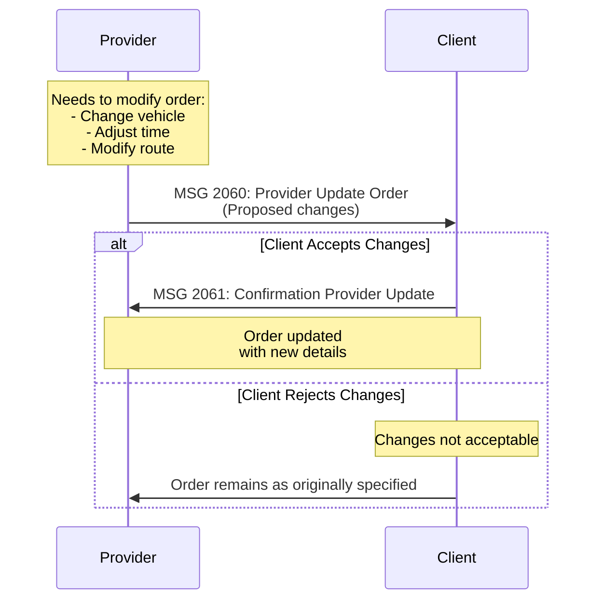
```mermaid
sequenceDiagram
    participant P as Provider
    participant C as Client

    Note over P: Needs to modify order:<br/>- Change vehicle<br/>- Adjust time<br/>- Modify route

    P->>C: MSG 2060: Provider Update Order<br/>(Proposed changes)

    alt Client Accepts Changes
        C->>P: MSG 2061: Confirmation Provider Update
        Note over C,P: Order updated<br/>with new details

    else Client Rejects Changes
        Note over C: Changes not acceptable
        C->>P: Order remains as originally specified
    end
```

**Use Cases**:
- Vehicle substitution required
- Time adjustment needed
- Route optimization suggestion

---

### Order Status Flow

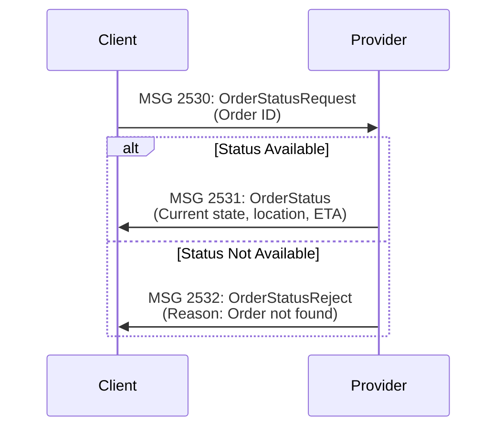
```mermaid
sequenceDiagram
    participant C as Client
    participant P as Provider

    C->>P: MSG 2530: OrderStatusRequest<br/>(Order ID)

    alt Status Available
        P->>C: MSG 2531: OrderStatus<br/>(Current state, location, ETA)
    else Status Not Available
        P->>C: MSG 2532: OrderStatusReject<br/>(Reason: Order not found)
    end
```

**Use Cases**:
- Client checks order progress
- Passenger inquires about arrival time
- System monitoring

---

### Authorization Flow

Request authorization for order-related actions:

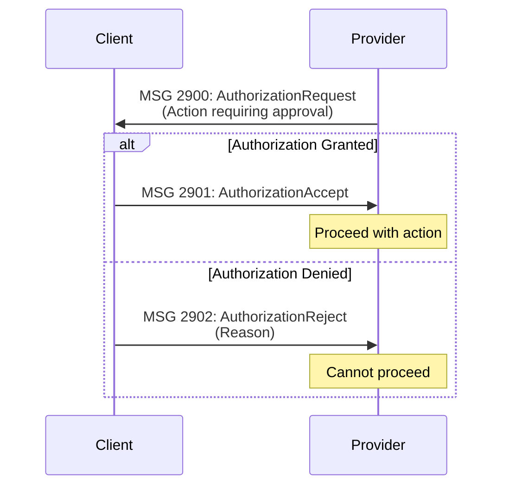
```mermaid
sequenceDiagram
    participant C as Client
    participant P as Provider

    P->>C: MSG 2900: AuthorizationRequest<br/>(Action requiring approval)

    alt Authorization Granted
        C->>P: MSG 2901: AuthorizationAccept
        Note over P: Proceed with action

    else Authorization Denied
        C->>P: MSG 2902: AuthorizationReject<br/>(Reason)
        Note over P: Cannot proceed
    end
```

**Use Cases**:
- Exceeding price limits
- Special service requests
- Contract violations

---

### Order Template Flow

Pre-defined order patterns for recurring services:

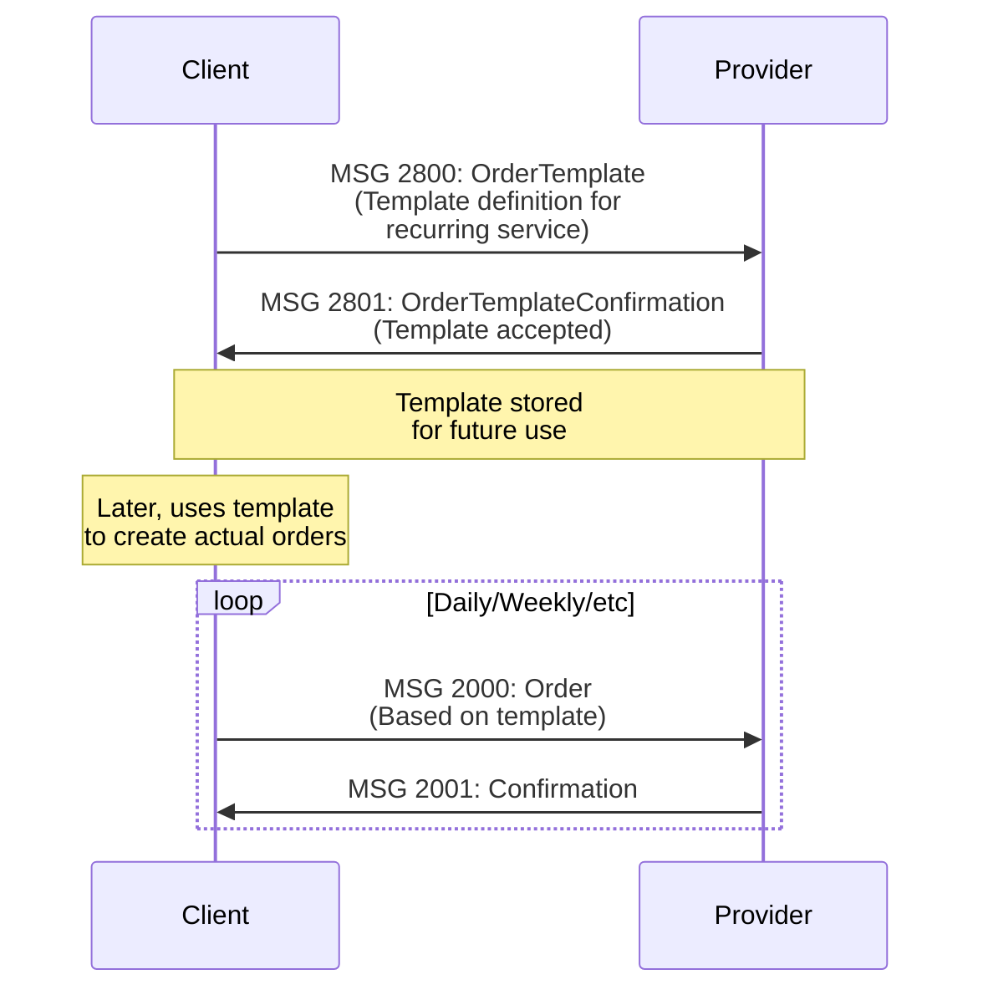
```mermaid
sequenceDiagram
    participant C as Client
    participant P as Provider

    C->>P: MSG 2800: OrderTemplate<br/>(Template definition for<br/>recurring service)

    P->>C: MSG 2801: OrderTemplateConfirmation<br/>(Template accepted)

    Note over C,P: Template stored<br/>for future use

    Note over C: Later, uses template<br/>to create actual orders

    loop Daily/Weekly/etc
        C->>P: MSG 2000: Order<br/>(Based on template)
        P->>C: MSG 2001: Confirmation
    end
```

**Use Cases**:
- School transport (daily recurring)
- Medical appointments (weekly)
- Shift worker transport

---

## Complex Flow Example: Shared Ride Order

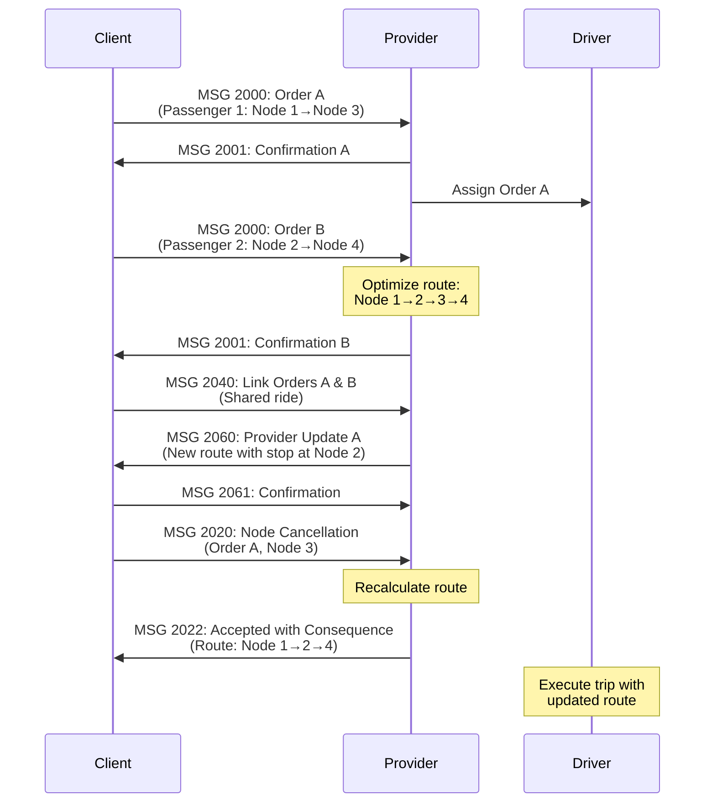
```mermaid
sequenceDiagram
    participant C as Client
    participant P as Provider
    participant D as Driver

    %% First passenger
    C->>P: MSG 2000: Order A<br/>(Passenger 1: Node 1→Node 3)
    P->>C: MSG 2001: Confirmation A
    P->>D: Assign Order A

    %% Second passenger joins
    C->>P: MSG 2000: Order B<br/>(Passenger 2: Node 2→Node 4)
    Note over P: Optimize route:<br/>Node 1→2→3→4
    P->>C: MSG 2001: Confirmation B

    C->>P: MSG 2040: Link Orders A & B<br/>(Shared ride)

    %% Route update
    P->>C: MSG 2060: Provider Update A<br/>(New route with stop at Node 2)
    C->>P: MSG 2061: Confirmation

    %% Passenger 1 cancels Node 3
    C->>P: MSG 2020: Node Cancellation<br/>(Order A, Node 3)
    Note over P: Recalculate route
    P->>C: MSG 2022: Accepted with Consequence<br/>(Route: Node 1→2→4)

    Note over D: Execute trip with<br/>updated route
```

---

## DriverSession Flows

DriverSession is an alternative to Order-by-Order management, where all orders for a driver's session are sent together:

### Basic DriverSession Flow

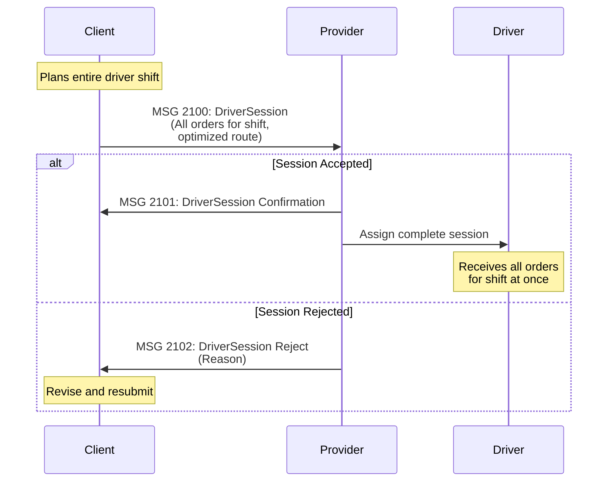
```mermaid
sequenceDiagram
    participant C as Client
    participant P as Provider
    participant D as Driver

    Note over C: Plans entire driver shift

    C->>P: MSG 2100: DriverSession<br/>(All orders for shift,<br/>optimized route)

    alt Session Accepted
        P->>C: MSG 2101: DriverSession Confirmation
        P->>D: Assign complete session
        Note over D: Receives all orders<br/>for shift at once

    else Session Rejected
        P->>C: MSG 2102: DriverSession Reject<br/>(Reason)
        Note over C: Revise and resubmit
    end
```

### DriverSession Modification Flow

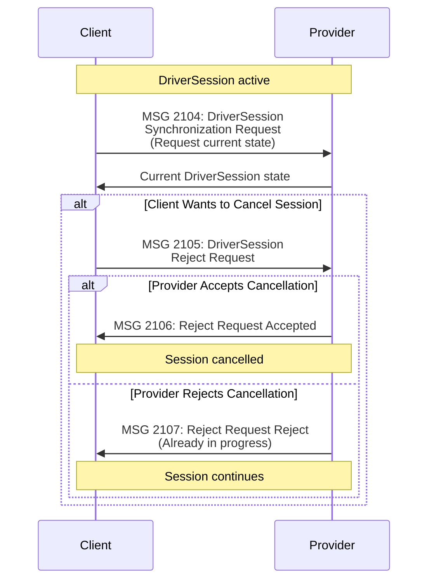
```mermaid
sequenceDiagram
    participant C as Client
    participant P as Provider

    Note over C,P: DriverSession active

    C->>P: MSG 2104: DriverSession<br/>Synchronization Request<br/>(Request current state)

    P->>C: Current DriverSession state

    alt Client Wants to Cancel Session
        C->>P: MSG 2105: DriverSession<br/>Reject Request

        alt Provider Accepts Cancellation
            P->>C: MSG 2106: Reject Request Accepted
            Note over C,P: Session cancelled

        else Provider Rejects Cancellation
            P->>C: MSG 2107: Reject Request Reject<br/>(Already in progress)
            Note over C,P: Session continues
        end
    end
```

---

## Order Lifecycle State Diagram

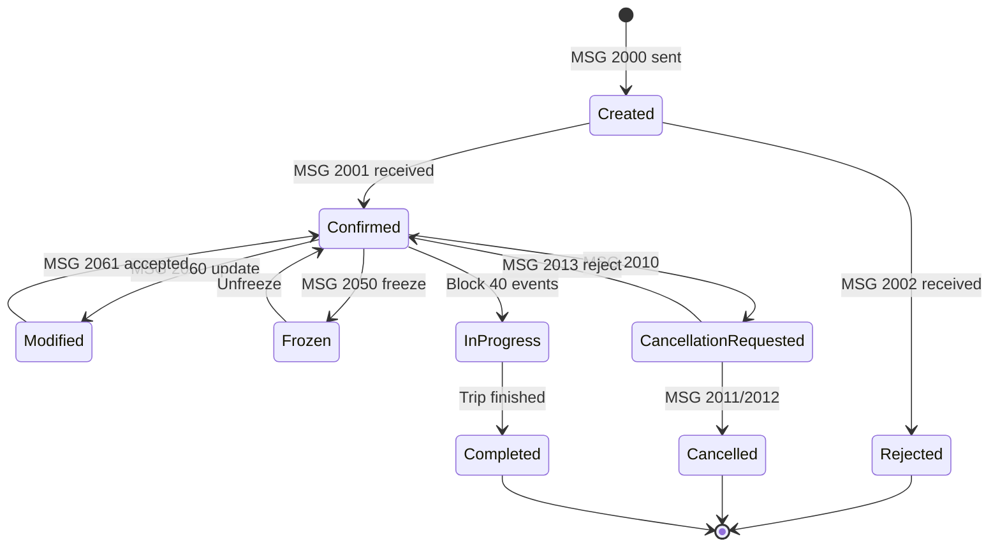
```mermaid
stateDiagram-v2
    [*] --> Created: MSG 2000 sent
    Created --> Confirmed: MSG 2001 received
    Created --> Rejected: MSG 2002 received

    Rejected --> [*]

    Confirmed --> Modified: MSG 2060 update
    Modified --> Confirmed: MSG 2061 accepted

    Confirmed --> Frozen: MSG 2050 freeze
    Frozen --> Confirmed: Unfreeze

    Confirmed --> CancellationRequested: MSG 2010
    CancellationRequested --> Cancelled: MSG 2011/2012
    CancellationRequested --> Confirmed: MSG 2013 reject

    Cancelled --> [*]

    Confirmed --> InProgress: Block 40 events
    InProgress --> Completed: Trip finished
    Completed --> [*]
```

---

## Error Handling Patterns

### Duplicate Order Prevention

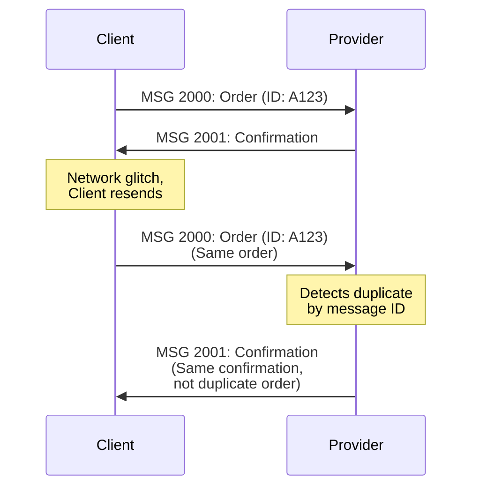
```mermaid
sequenceDiagram
    participant C as Client
    participant P as Provider

    C->>P: MSG 2000: Order (ID: A123)
    P->>C: MSG 2001: Confirmation

    Note over C: Network glitch,<br/>Client resends

    C->>P: MSG 2000: Order (ID: A123)<br/>(Same order)

    Note over P: Detects duplicate<br/>by message ID

    P->>C: MSG 2001: Confirmation<br/>(Same confirmation,<br/>not duplicate order)
```

### Late Cancellation Handling

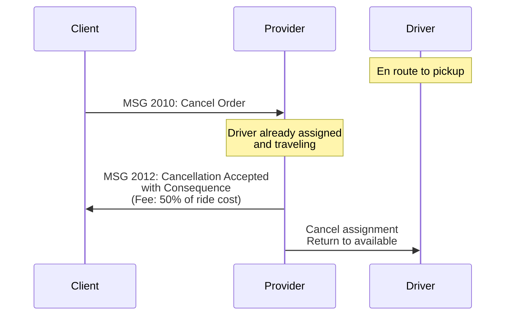
```mermaid
sequenceDiagram
    participant C as Client
    participant P as Provider
    participant D as Driver

    Note over D: En route to pickup

    C->>P: MSG 2010: Cancel Order

    Note over P: Driver already assigned<br/>and traveling

    P->>C: MSG 2012: Cancellation Accepted<br/>with Consequence<br/>(Fee: 50% of ride cost)

    P->>D: Cancel assignment<br/>Return to available
```

---

## Best Practices

### Order Creation
1. **Include complete information**: All required fields in MSG 2000
2. **Validate before sending**: Check route, time, passenger details
3. **Unique IDs**: Each order must have unique identifier
4. **Handle timeouts**: Set reasonable timeout for confirmation

### Order Modification
1. **Minimize changes**: Avoid frequent updates
2. **Check feasibility**: Ensure changes are possible before requesting
3. **Communicate clearly**: Explain reason for changes
4. **Version tracking**: Track order version for audit trail

### Order Cancellation
1. **Cancel early**: Earlier cancellation = lower penalty
2. **Provide reason**: Help Provider understand pattern
3. **Check consequences**: Be aware of cancellation policies
4. **Confirm receipt**: Verify cancellation was processed

---

## Additional Resources

- **[Block 20 Messages](../messages/block-20-order.md)** - Message specifications
- **[XML Examples](../../examples/README.md#block-20-order-management)** - Validated examples
- **[Use Cases](../use-cases/order-flows.md)** - Real-world scenarios

---

[← Block 10 Flows](block-10-flows.md) | [Flow Index →](README.md) | [Block 30 Flows →](block-30-flows.md)
