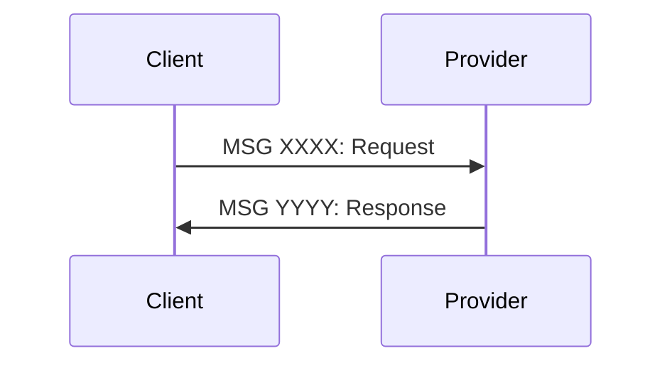
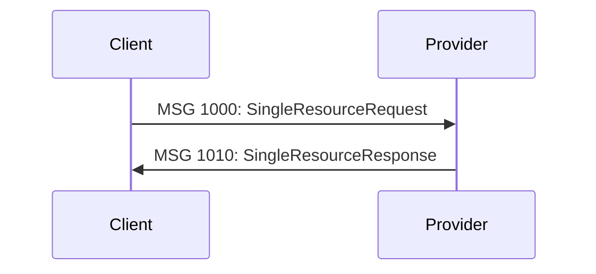
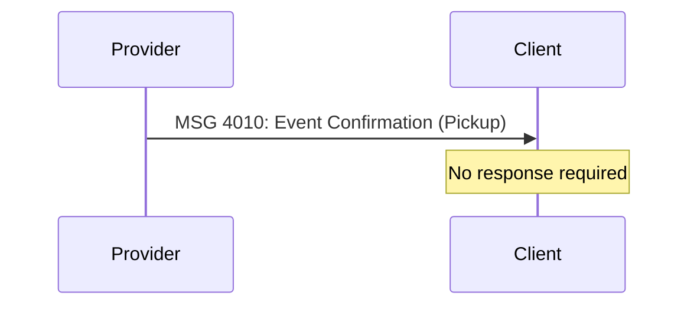

# SUTI Message Reference

> Complete specifications for all SUTI message types

---

## Message Blocks

SUTI organizes **90+ message types** into 9 logical blocks. Each block handles a specific aspect of Demand Responsive Transport operations.

| Block | Title | Messages | Status | Documentation |
|-------|-------|----------|--------|---------------|
| **[10](block-10-resource.md)** | Dynamic Resource Utilization | 1000-1922 | ✅ Complete | Resource management, login/logout |
| **[20](block-20-order.md)** | Order Management | 2000-2902 | 🚧 In Progress | Order lifecycle, cancellation |
| **[30](block-30-dispatch.md)** | Dispatch | 3000-3013 | 📋 Planned | Driver assignment, dispatch ops |
| **[40](block-40-traffic.md)** | Traffic Control | 4000-4102 | 📋 Planned | Events, pickups, drop-offs |
| **[50](block-50-communication.md)** | Communication | 5000-5021 | 📋 Planned | Information exchange |
| **[60](block-60-report.md)** | Reports | 6001-6810 | 📋 Planned | Trip reports, statistics |
| **[70](block-70-technical.md)** | Technical Control | 7000-7101 | 📋 Planned | System monitoring, link mapping |
| **[80](block-80-accounting.md)** | Accounting | 8000-8199 | 📋 Planned | Billing, invoices, settlement |
| **[90](block-90-versions.md)** | Alterations | Version History | 📋 Planned | Standard version changelog |

---

## Quick Navigation

### By Use Case

**Setting Up Connection**
- [Block 70: Technical Control](block-70-technical.md) - Link Mapping (MSG 7100, 7101)
- [Block 10: Resource](block-10-resource.md) - Resource Login (MSG 1020-1025)

**Creating Orders**
- [Block 20: Order Management](block-20-order.md) - Order, Confirmation, Reject (MSG 2000-2002)
- [Block 30: Dispatch](block-30-dispatch.md) - Driver Assignment (MSG 3000-3013)

**During Transport**
- [Block 40: Traffic Control](block-40-traffic.md) - Pickup/Drop-off Events (MSG 4010-4012)
- [Block 50: Communication](block-50-communication.md) - Driver Messages (MSG 5000-5021)

**After Transport**
- [Block 60: Reports](block-60-report.md) - Trip Reports (MSG 6001, 6810)
- [Block 80: Accounting](block-80-accounting.md) - Invoicing (MSG 8000-8199)

### By Actor

**Client Sends** (Request Messages)
- MSG 1000-1002: Resource Requests
- MSG 2000: Order
- MSG 2010-2020: Order Modifications
- MSG 3000-3003: Dispatch Requests
- MSG 5000, 5010: Information Requests
- MSG 7000-7010: Technical Control

**Provider Sends** (Response Messages)
- MSG 1010-1012: Resource Responses
- MSG 1020-1025: Resource Login/Logoff
- MSG 2001-2002: Order Responses
- MSG 4010-4102: Traffic Events
- MSG 6001-6810: Reports
- MSG 8000-8199: Accounting

**Bidirectional**
- MSG 2030-2032: Order Forwarding
- MSG 5011-5021: Communication
- MSG 7100-7101: Link Mapping

---

## Message Structure

All SUTI messages follow this basic structure:

```xml
<SUTI xmlns:xsi="http://www.w3.org/2001/XMLSchema-instance"
      xsi:noNamespaceSchemaLocation="../../schemas/SUTI_Message.xsd">

  <orgSender name="...">
    <idOrg src="SUTI:idLink" id="..." unique="true"/>
  </orgSender>

  <orgReceiver name="...">
    <idOrg src="SUTI:idLink" id="..." unique="true"/>
  </orgReceiver>

  <msg msgType="XXXX" msgName="...">
    <idMsg src="...:idMsg" id="..." unique="true"/>

    <!-- Message-specific content -->

  </msg>
</SUTI>
```

### Key Components

| Element | Purpose | Required |
|---------|---------|----------|
| `<SUTI>` | Root element | ✅ Yes |
| `<orgSender>` | Identifies message sender | ✅ Yes |
| `<orgReceiver>` | Identifies message recipient | ✅ Yes |
| `<msg>` | Contains message content | ✅ Yes |
| `msgType` | 4-digit message number | ✅ Yes |
| `msgName` | Human-readable message name | ✅ Yes |
| `<idMsg>` | Unique message identifier | ✅ Yes |
| `<referencesTo>` | Links to related messages | ⚠️ Optional |

---

## Understanding Message Flows

### Request-Response Pattern

Most SUTI messages follow a request-response pattern:



**Example: Resource Request**


### Event Pattern

Some messages are event notifications (no response required):



---

## Message Properties

Each message specification includes:

### Standard Fields

- **Message Type**: 4-digit identifier (e.g., 2000)
- **Message Name**: Descriptive name (e.g., "Order")
- **Description**: What the message does
- **Sender**: Client or Provider
- **Receiver**: Provider or Client
- **Response Required**: YES or NO
- **Response Message**: Which message(s) should respond

### Optional Fields

- **Client Action**: What the Client should do
- **Provider Action**: What the Provider should do
- **Intended Use**: Detailed usage scenarios
- **Related Messages**: Links to connected messages

---

## XML Examples

The repository contains **35+ validated XML examples** demonstrating proper message structure.

[Browse Examples Catalog →](../../examples/README.md)

### Examples by Block

- **Block 10**: 1020.xml, 1021.xml, 1022.xml, 1023.xml
- **Block 20**: 2000.xml, 2000_OrderAlter.xml, 2001.xml, 2010.xml, 2011.xml
- **Block 30**: 3003.xml
- **Block 40**: 4010_Pickup.xml, 4010_Drop.xml, 4010_Bom.xml, 4011_*.xml, 4012_*.xml
- **Block 50**: 5010.xml, 5011.xml
- **Block 60**: 6001.xml, 6810.xml
- **Block 70**: 7010.xml, 7100.xml, 7101.xml
- **Block 80**: 8010.xml, 8011.xml

---

## Validation

Validate any message against the XSD schema:

```bash
# Single message
xmllint --noout --schema schemas/SUTI_Message.xsd examples/XML/2000.xml

# All messages in a block
for file in examples/XML/20*.xml; do
  echo "Validating: $(basename "$file")"
  xmllint --noout --schema schemas/SUTI_Message.xsd "$file"
done
```

[View Validation Guide →](../schemas/validation-guide.md)

---

## Additional Resources

### Documentation

- **[SUTI Messages PDF](../SUTI_Messages.pdf)** - Original 54-page specification
- **[Message Flows](../message-flows/README.md)** - Visual sequence diagrams
- **[Use Cases](../use-cases/README.md)** - Real-world implementation scenarios
- **[Getting Started](../getting-started/README.md)** - Implementation guide

### Tools

- **[XSD Schema](../../schemas/SUTI_Message.xsd)** - XML Schema Definition
- **[Examples](../../examples/README.md)** - Validated XML examples
- **[Validation Tools](../schemas/validation-guide.md)** - How to validate messages

---

## Message Block Details

Click any block below to view complete message specifications:

### [Block 10: Dynamic Resource Utilization →](block-10-resource.md)

Resource management, availability, login/logout operations.

**Key Messages**: 1000, 1010, 1020-1025, 1060-1062, 1100-1112, 1500-1601, 1920-1922

### [Block 20: Order Management →](block-20-order.md)

Complete order lifecycle from creation to completion.

**Key Messages**: 2000-2002 (Order, Confirm, Reject), 2010-2013 (Cancellation), 2020-2023 (Node Cancellation), 2100-2107 (DriverSession)

### [Block 30: Dispatch →](block-30-dispatch.md)

Driver assignment and dispatch operations.

**Key Messages**: 3000-3013

### [Block 40: Traffic Control →](block-40-traffic.md)

Real-time traffic events during transport.

**Key Messages**: 4010-4012 (Events), 4040-4042 (Traffic Control), 4100-4102

### [Block 50: Communication →](block-50-communication.md)

Information exchange between systems.

**Key Messages**: 5000-5021

### [Block 60: Reports →](block-60-report.md)

Trip reports and statistical data.

**Key Messages**: 6001 (Trip Report), 6500-6511, 6810 (Statistics)

### [Block 70: Technical Control →](block-70-technical.md)

System monitoring and link establishment.

**Key Messages**: 7000-7031, 7100-7101 (Link Mapping)

### [Block 80: Accounting →](block-80-accounting.md)

Billing, invoices, and financial settlement.

**Key Messages**: 8000-8199

### [Block 90: Alterations →](block-90-versions.md)

Version history and standard evolution.

**Versions**: 1.0.0 → 2026 (current)

---

## Contributing

Found an error or have suggestions for improving the message documentation?

1. Check [existing issues](https://github.com/SUTI-se/SUTI/issues)
2. Open a new issue with details
3. Or submit a pull request

---

[← Back to Documentation Hub](../README.md) | [View Examples →](../../examples/README.md)
