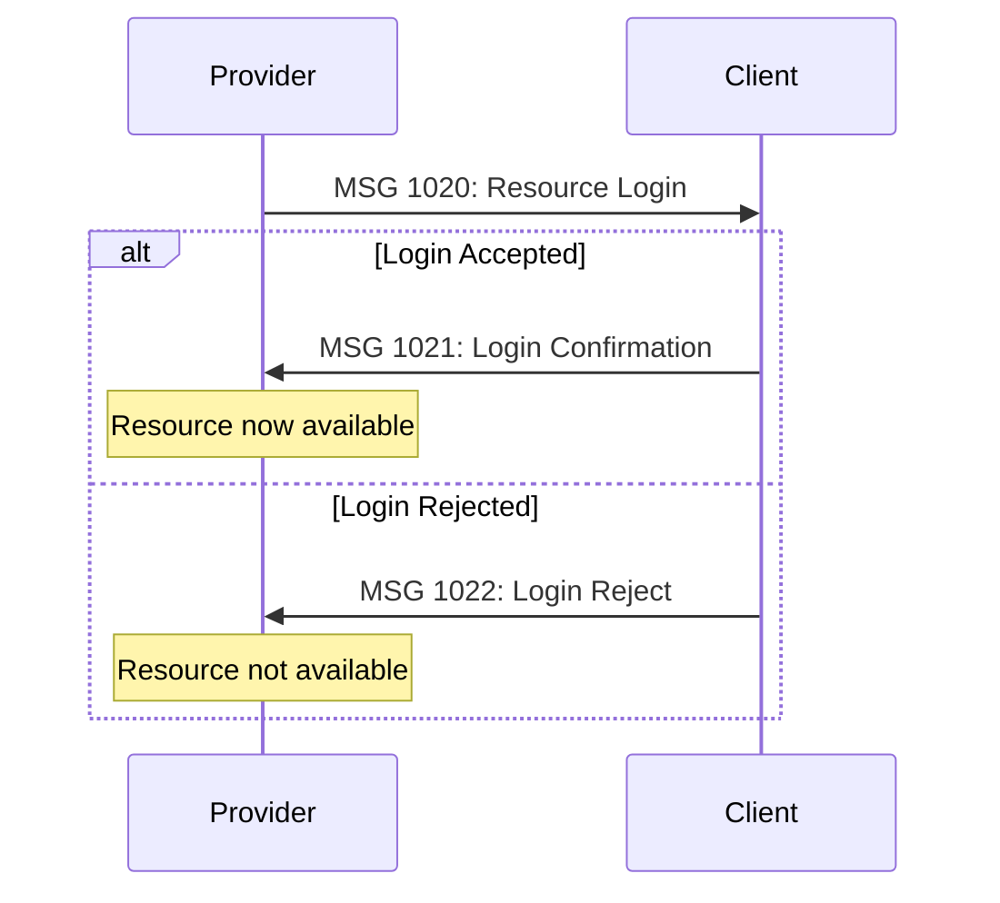
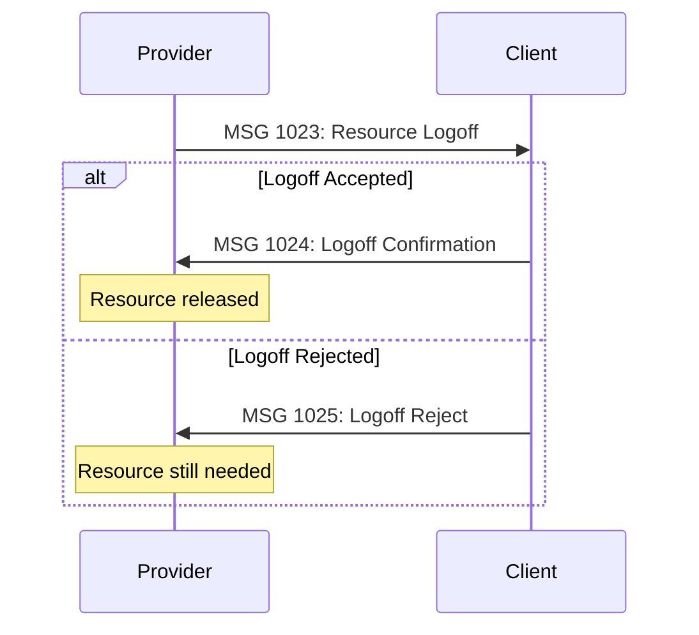

# Block 10: Dynamic Resource Utilization

> Tools for dynamic alteration of resources agreed upon by Client and Provider

---

## Overview

**Block 10** provides tools to perform dynamic alteration of the resources that are agreed upon by the Client and the Provider. It enables the Client or Provider to offer/request more or less of a resource during a certain period.

**Message Range**: 1000-1922

**Primary Use Cases**:
- Resource availability management
- Driver/vehicle login and logout
- Resource requests and responses
- Price and rating information

---

## Messages in this Block

### Resource Requests
- [MSG 1000: SingleResourceRequest](#msg-1000-singleresourcerequest)
- [MSG 1001: AgreementResourcesRequest](#msg-1001-agreementresourcesrequest)
- [MSG 1002: AllResourcesRequest](#msg-1002-allresourcesrequest)

### Resource Responses
- [MSG 1010: SingleResourceResponse](#msg-1010-singleresourceresponse)
- [MSG 1011: AgreementResourceResponse](#msg-1011-agreementresourceresponse)
- [MSG 1012: AllResourceResponse](#msg-1012-allresourceresponse)

### Resource Login/Logout
- [MSG 1020: Resource Login](#msg-1020-resource-login) ⭐
- [MSG 1021: Resource Login Confirmation](#msg-1021-resource-login-confirmation) ⭐
- [MSG 1022: Resource Login Reject](#msg-1022-resource-login-reject) ⭐
- [MSG 1023: Resource Logoff](#msg-1023-resource-logoff) ⭐
- [MSG 1024: Resource Logoff Confirmation](#msg-1024-resource-logoff-confirmation) ⭐
- [MSG 1025: Resource Logoff Reject](#msg-1025-resource-logoff-reject) ⭐

### Rating
- [MSG 1060: RatingRequest](#msg-1060-ratingrequest)
- [MSG 1061: RatingResponse](#msg-1061-ratingresponse)
- [MSG 1062: RatingRequestReject](#msg-1062-ratingrequestreject)

### Bulk Locations
- MSG 1100-1102: Bulk Location Requests
- MSG 1110-1112: Bulk Location Responses

### Node and Price Lists
- MSG 1500: NodeListRequest
- MSG 1501: PriceRequest
- MSG 1600: NodeListResponse
- MSG 1601: PriceResponse

### Resource Allocation
- MSG 1920: Resource Allocation
- MSG 1921: Resource Allocation Accept
- MSG 1922: Resource Allocation Reject

---

## Common Message Flow

### Resource Login Sequence



### Resource Logoff Sequence



---

## Message Specifications

### MSG 1000: SingleResourceRequest

**Description**: Request for resource regarding one specific vehicle and its driver.

| Property | Value |
|----------|-------|
| **Message Type** | 1000 |
| **Message Name** | SingleResourceRequest |
| **Sender** | Client |
| **Receiver** | Provider |
| **Response Required** | YES |
| **Response Messages** | MSG 1010 |

**Provider Action**:
- Immediately respond to MSG 1000 with MSG 1010

**XML Examples**: *(No example available)*

---

### MSG 1001: AgreementResourcesRequest

**Description**: Request for all resources in a specific agreement (link).

| Property | Value |
|----------|-------|
| **Message Type** | 1001 |
| **Message Name** | AgreementResourcesRequest |
| **Sender** | Client |
| **Receiver** | Provider |
| **Response Required** | YES |
| **Response Messages** | MSG 1011 |

**XML Examples**: *(No example available)*

---

### MSG 1002: AllResourcesRequest

**Description**: Request for all resources at the Provider.

| Property | Value |
|----------|-------|
| **Message Type** | 1002 |
| **Message Name** | AllResourcesRequest |
| **Sender** | Client |
| **Receiver** | Provider |
| **Response Required** | YES |
| **Response Messages** | MSG 1012 |

**XML Examples**: *(No example available)*

---

### MSG 1010: SingleResourceResponse

**Description**: Response to MSG 1000 containing the requested resource information.

| Property | Value |
|----------|-------|
| **Message Type** | 1010 |
| **Message Name** | SingleResourceResponse |
| **Sender** | Provider |
| **Receiver** | Client |
| **Response Required** | NO |
| **Response Messages** | - |

**Provider Action**:
- Immediately respond to MSG 1000 with MSG 1010

**XML Examples**: *(No example available)*

---

### MSG 1011: AgreementResourceResponse

**Description**: Response to MSG 1001. Several MSG 1011 messages, each containing one requested resource.

| Property | Value |
|----------|-------|
| **Message Type** | 1011 |
| **Message Name** | AgreementResourceResponse |
| **Sender** | Provider |
| **Receiver** | Client |
| **Response Required** | NO |
| **Response Messages** | - |

**Provider Action**:
- Immediately respond to MSG 1001 with MSG 1011

**XML Examples**: *(No example available)*

---

### MSG 1012: AllResourceResponse

**Description**: Response to MSG 1002. Several MSG 1012 messages, each containing one requested resource.

| Property | Value |
|----------|-------|
| **Message Type** | 1012 |
| **Message Name** | AllResourceResponse |
| **Sender** | Provider |
| **Receiver** | Client |
| **Response Required** | NO |
| **Response Messages** | - |

**Provider Action**:
- Immediately respond to MSG 1002 with MSG 1012

**XML Examples**: *(No example available)*

---

### MSG 1020: Resource Login

**Description**: Login message for an available resource (e.g. a vehicle). At the start of a shift, a vehicle can login to the Client's system with driver ID, vehicle number, and optionally a password. The message can also contain the vehicle's configuration and attributes.

| Property | Value |
|----------|-------|
| **Message Type** | 1020 |
| **Message Name** | Resource Login |
| **Sender** | Provider |
| **Receiver** | Client |
| **Response Required** | YES |
| **Response Messages** | MSG 1021, MSG 1022 |

**Client Actions**:
- Check if the offered resource meets the demands
- Optionally check if the supplied password is correct

**XML Examples**:
- [1020.xml](../../examples/XML/1020.xml) - Resource login example

**Validation**:
```bash
xmllint --noout --schema schemas/SUTI_Message.xsd examples/XML/1020.xml
```

**Typical Usage**:
1. Driver starts shift
2. Provider system sends MSG 1020 with vehicle/driver details
3. Client validates resource against requirements
4. Client responds with MSG 1021 (accept) or MSG 1022 (reject)

---

### MSG 1021: Resource Login Confirmation

**Description**: Positive response to MSG 1020. Indicates that the referred resource complies with the Client's demands and is now available for the Client to use.

| Property | Value |
|----------|-------|
| **Message Type** | 1021 |
| **Message Name** | Resource Login Confirmation |
| **Sender** | Client |
| **Receiver** | Provider |
| **Response Required** | NO |
| **Response Messages** | - |

**XML Examples**:
- [1021.xml](../../examples/XML/1021.xml) - Login confirmation

**Validation**:
```bash
xmllint --noout --schema schemas/SUTI_Message.xsd examples/XML/1021.xml
```

---

### MSG 1022: Resource Login Reject

**Description**: Negative response to MSG 1020. Indicates that the referred resource does not comply with the Client's demands, is not needed at the moment, or MSG 1020 contained an incorrect password.

| Property | Value |
|----------|-------|
| **Message Type** | 1022 |
| **Message Name** | Resource Login Reject |
| **Sender** | Client |
| **Receiver** | Provider |
| **Response Required** | NO |
| **Response Messages** | - |

**Client Actions**:
- Inform the Provider the reason for the rejection

**XML Examples**:
- [1022.xml](../../examples/XML/1022.xml) - Login rejection

**Validation**:
```bash
xmllint --noout --schema schemas/SUTI_Message.xsd examples/XML/1022.xml
```

**Rejection Reasons**:
- Resource doesn't meet requirements (wrong vehicle type, capacity, etc.)
- Resource not needed currently (sufficient vehicles already logged in)
- Incorrect password
- Resource not authorized for this Client

---

### MSG 1023: Resource Logoff

**Description**: Logout message for a resource (e.g. a vehicle). The Provider sends this message at the end of a shift and waits for the response from the Client before releasing the vehicle from the shift.

| Property | Value |
|----------|-------|
| **Message Type** | 1023 |
| **Message Name** | Resource Logoff |
| **Sender** | Provider |
| **Receiver** | Client |
| **Response Required** | YES |
| **Response Messages** | MSG 1024, MSG 1025 |

**Client Actions**:
- Determine if it's possible to release the resource

**XML Examples**:
- [1023.xml](../../examples/XML/1023.xml) - Resource logoff

**Validation**:
```bash
xmllint --noout --schema schemas/SUTI_Message.xsd examples/XML/1023.xml
```

**Typical Usage**:
1. Driver ends shift
2. Provider sends MSG 1023 to request resource logoff
3. Client checks if resource has pending orders
4. Client responds with MSG 1024 (accept) or MSG 1025 (reject if orders pending)

---

### MSG 1024: Resource Logoff Confirmation

**Description**: Positive response to MSG 1023. The Client confirms that the resource is no longer available and will not send further orders.

| Property | Value |
|----------|-------|
| **Message Type** | 1024 |
| **Message Name** | Resource Logoff Confirmation |
| **Sender** | Client |
| **Receiver** | Provider |
| **Response Required** | NO |
| **Response Messages** | - |

**Provider Actions**:
- Remove the resource from the Client's allocated resources

**XML Examples**: *(No example available)*

---

### MSG 1025: Resource Logoff Reject

**Description**: Negative response to MSG 1023. The Client still considers the resource as logged in. For example, the Client still has orders for the resource to perform.

| Property | Value |
|----------|-------|
| **Message Type** | 1025 |
| **Message Name** | Resource Logoff Reject |
| **Sender** | Client |
| **Receiver** | Provider |
| **Response Required** | NO |
| **Response Messages** | - |

**Client Actions**:
- Inform the Provider the reason for the rejection

**Provider Actions**:
- Make sure that the resource is still in traffic

**XML Examples**: *(No example available)*

**Common Rejection Reasons**:
- Resource has pending orders
- Resource is assigned to active trip
- Resource needed for scheduled orders

---

### MSG 1060: RatingRequest

**Description**: Message that requests Rating (MSG 1061). Can be used for a specific order (Block 60) or multiple orders (Block 10).

| Property | Value |
|----------|-------|
| **Message Type** | 1060 |
| **Message Name** | RatingRequest |
| **Sender** | Client/Provider |
| **Receiver** | Provider/Client |
| **Response Required** | NO |
| **Response Messages** | - |

**Note**: MSG 6060 in Block 60 is the same message. When used in Block 60, it concerns only a specific finished order. When used in Block 10, it concerns several finished orders or an average for multiple orders.

**XML Examples**: *(No example available)*

---

### MSG 1061: RatingResponse

**Description**: Response containing rating information for orders.

| Property | Value |
|----------|-------|
| **Message Type** | 1061 |
| **Message Name** | RatingResponse |
| **Sender** | Client/Provider |
| **Receiver** | Provider/Client |
| **Response Required** | NO |
| **Response Messages** | - |

**XML Examples**: *(No example available)*

---

### MSG 1062: RatingRequestReject

**Description**: Rejection of a rating request.

| Property | Value |
|----------|-------|
| **Message Type** | 1062 |
| **Message Name** | RatingRequestReject |
| **Sender** | Client/Provider |
| **Receiver** | Provider/Client |
| **Response Required** | NO |
| **Response Messages** | - |

**XML Examples**: *(No example available)*

---

## Implementation Notes

### Resource Login Best Practices

1. **Authentication**: Always validate resource credentials
2. **Configuration**: Send complete vehicle configuration in MSG 1020
3. **Attributes**: Include relevant attributes (wheelchair accessible, vehicle size, etc.)
4. **Password**: Use secure password handling if implementing authentication
5. **Timeout**: Set reasonable timeout for login confirmation

### Resource Logoff Best Practices

1. **Pending Orders**: Always check for pending orders before confirming logoff
2. **Grace Period**: Consider allowing grace period for final order completion
3. **Communication**: Inform driver if logoff is rejected and why
4. **Shift End**: Coordinate logoff with actual shift end times

### Error Handling

**Login Rejected**:
- Provide clear reason in rejection message
- Log rejection for audit purposes
- Allow retry with corrected information

**Logoff Rejected**:
- Inform driver of pending orders
- Provide estimated time until logoff possible
- Allow force logoff in emergency situations (with proper authorization)

---

## XML Examples Summary

Available examples for Block 10:

| Message | Example File | Description |
|---------|--------------|-------------|
| MSG 1020 | [1020.xml](../../examples/XML/1020.xml) | Resource login |
| MSG 1021 | [1021.xml](../../examples/XML/1021.xml) | Login confirmation |
| MSG 1022 | [1022.xml](../../examples/XML/1022.xml) | Login rejection |
| MSG 1023 | [1023.xml](../../examples/XML/1023.xml) | Resource logoff |

**Note**: Additional messages in this block do not yet have example files. Contact the SUTI Technical Committee for complete examples.

---

## Additional Resources

- **[SUTI Messages PDF](../SUTI_Messages.pdf)** - Original specification (pages 5-11)
- **[Message Flows](../message-flows/block-10-flows.md)** - Visual flow diagrams
- **[Use Cases](../use-cases/README.md)** - Real-world implementation scenarios
- **[XSD Schema](../../schemas/SUTI_Message.xsd)** - XML Schema Definition

---

[← Back to Messages](README.md) | [Next: Block 20 Order →](block-20-order.md)
