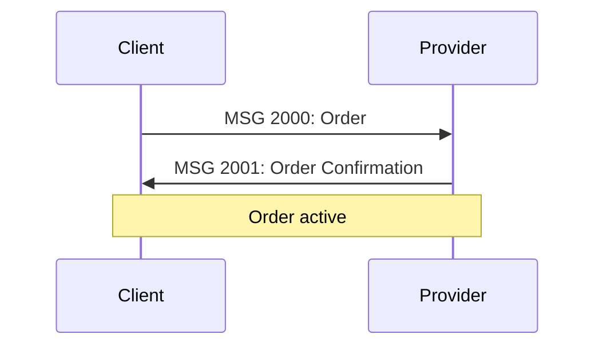

# Block 20: Order Management

> Complete order lifecycle from creation to completion

---

## Overview

**Block 20** contains messages for creating, confirming, rejecting, and managing transport orders throughout their entire lifecycle.

**Message Range**: 2000-2902

**Primary Use Cases**:
- Order creation and confirmation
- Order cancellation
- Node cancellation
- Order forwarding
- Order status updates
- DriverSession management

---

## Messages in this Block

### Core Order Messages
- MSG 2000: Order
- MSG 2001: Order Confirmation
- MSG 2002: Order Reject
- MSG 2003-2007: Order rejection handling

### Order Cancellation
- MSG 2010-2013: Order cancellation
- MSG 2020-2023: Node cancellation

### Order Management
- MSG 2030-2032: Order forwarding
- MSG 2040: Order linked
- MSG 2050: Order freeze
- MSG 2060-2061: Provider update order

### DriverSession
- MSG 2100-2107: DriverSession management

### Additional
- MSG 2500-2541: Order status and related messages
- MSG 2900-2902: Order alterations

---

## Common Message Flow

---

## XML Examples

Available examples for Block 20:

| Message | Example File | Description |
|---------|--------------|-------------|
| MSG 2000 | [2000.xml](../../examples/XML/2000.xml) | Basic order |
| MSG 2000 | [2000_OrderAlter.xml](../../examples/XML/2000_OrderAlter.xml) | Order with alteration |
| MSG 2001 | [2001.xml](../../examples/XML/2001.xml) | Order confirmation |
| MSG 2010 | [2010.xml](../../examples/XML/2010.xml) | Order cancellation request |
| MSG 2011 | [2011.xml](../../examples/XML/2011.xml) | Cancellation accepted |

[View all examples →](../../examples/README.md#block-20-order-management)

---

## Additional Resources

- **[SUTI Messages PDF](../SUTI_Messages.pdf)** - Original specification (pages 12-30)
- **[Message Flows](../message-flows/block-20-flows.md)** - Visual flow diagrams
- **[Use Cases](../use-cases/order-flows.md)** - Order implementation scenarios

---

*🚧 Detailed message specifications coming in future update*

[← Block 10: Resource](block-10-resource.md) | [Messages Overview →](README.md) | [Block 30: Dispatch →](block-30-dispatch.md)
