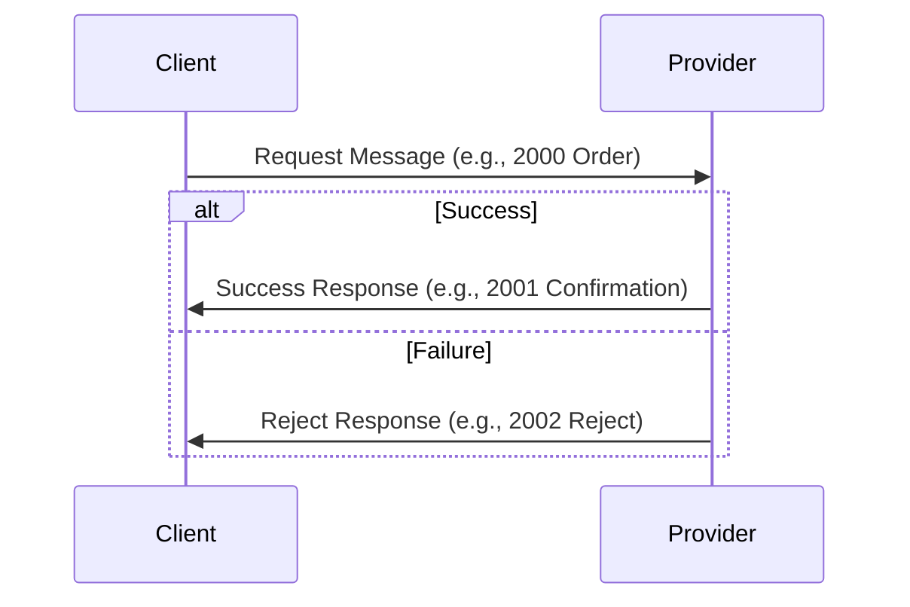
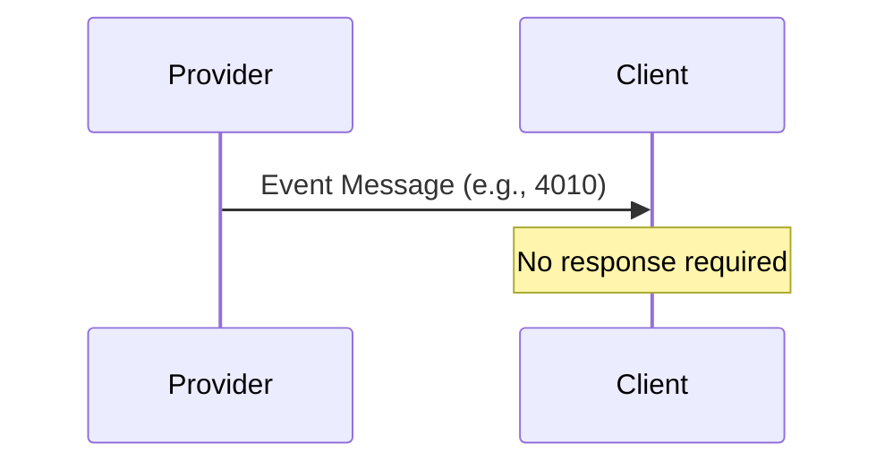
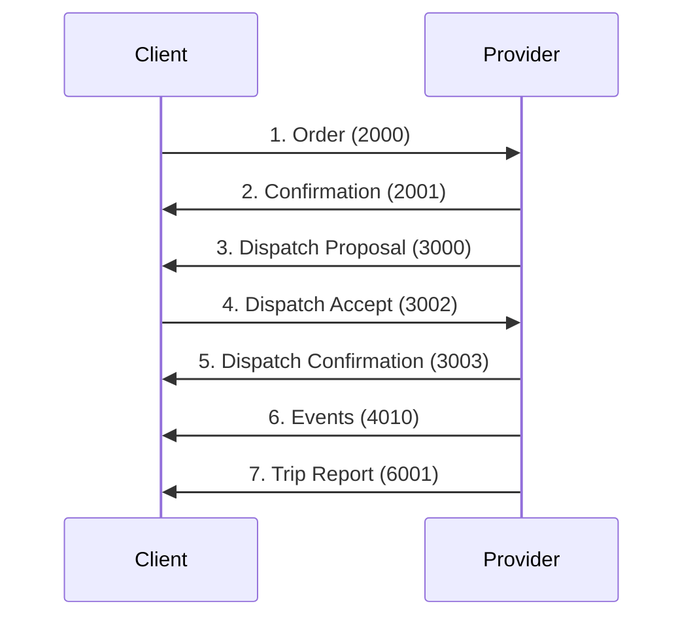
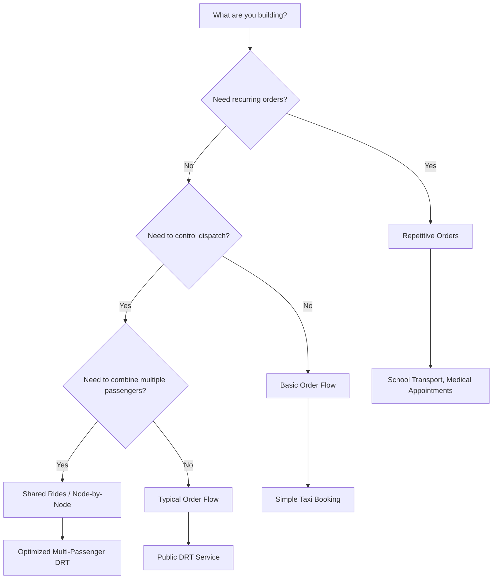

# SUTI Use Cases

> Real-world implementation scenarios and workflows

---

## Overview

This section provides practical use cases showing how SUTI messages work together in real-world scenarios. Each use case includes:

- **Business Context**: When to use this pattern
- **Message Flow**: Sequence of SUTI messages
- **Visual Diagrams**: Mermaid sequence diagrams
- **Implementation Notes**: Practical guidance
- **XML Examples**: Links to validated examples

---

## Use Case Categories

### By Implementation Complexity

| Complexity | Use Cases | Best For |
|------------|-----------|----------|
| **Basic** | [Basic Order Flow](#basic-order-flow) | Simple taxi booking, point-to-point transport |
| **Typical** | [Typical Order Flow](#typical-order-flow) | Standard DRT with dispatch and events |
| **Advanced** | [Node-by-Node Flow](#node-by-node-flow), [Shared Rides](#shared-rides) | Dynamic routing, optimized multi-passenger |
| **Specialized** | [Repetitive Orders](#repetitive-orders), [Accounting](#accounting) | School transport, regular medical appointments, billing |

---

## Quick Navigation

### By Actor

**I'm a Client (Booking System)**:
- [Basic Order Flow](order-flows.md#basic-flow) - Start here
- [Order Cancellation](order-flows.md#order-cancellation) - Handle changes
- [Shared Rides](order-flows.md#shared-rides) - Optimize multiple passengers
- [Repetitive Orders](repetitive-orders.md) - School transport, regular appointments

**I'm a Provider (Dispatch System)**:
- [Resource Login](traffic-control.md#resource-login) - Driver shifts
- [Dispatch Management](dispatch-flows.md) - Vehicle assignment
- [Traffic Events](traffic-control.md#traffic-events) - Pickup/drop-off reporting
- [Trip Reporting](reporting.md#trip-reports) - Complete trip data

---

### By Business Scenario

**Transport Authority**:
- [Node-by-Node Control](order-flows.md#node-by-node) - Full control over route
- [Resource Allocation](resource-management.md#allocation) - Reserve specific vehicles
- [Delivery Notes](reporting.md#delivery-notes) - Proof of delivery

**Taxi Company**:
- [Basic Order Flow](order-flows.md#basic-flow) - Simple bookings
- [Order by Order](order-flows.md#order-by-order) - Sequential orders
- [Direct Communication](communication.md#driver-communication) - Driver-passenger communication

**Healthcare Provider**:
- [Repetitive Orders](repetitive-orders.md) - Regular patient transport
- [Specialized Resources](resource-management.md#attributes) - Wheelchair-accessible, medical-trained driver
- [Connection Handling](order-flows.md#connections) - Hospital appointment coordination

**School District**:
- [OrderTemplate](repetitive-orders.md#order-template) - Daily school routes
- [Calendar Management](repetitive-orders.md#calendar) - Term schedules
- [Bulk Operations](repetitive-orders.md#bulk-operations) - Multiple students

---

## Use Case Documentation

### Order Flows

**[Order Flows Guide](order-flows.md)**

Comprehensive guide to order lifecycle management:

- **Basic Flow**: Minimal messages for simple orders
- **Typical Flow**: Standard dispatch and events
- **Extensive Flow**: Full Client control with dispatch approval
- **Node-by-Node**: Dynamic route building
- **Shared Rides**: Multiple orders combined
- **Order by Order**: Sequential order handling
- **DriverSession**: Real-time order additions

**Status**: ⏳ Planned

**Covers Messages**: 2000-2999 (Block 20)

---

### Repetitive Orders

**[Repetitive Orders Guide](repetitive-orders.md)**

Managing recurring transport over time periods:

- **OrderTemplate**: Define patterns
- **Calendar Management**: Schedules and exceptions
- **Schedule Elements**: Individual occurrences
- **Confirmation Flows**: Template and element confirmation

**Status**: ⏳ Planned

**Covers Messages**: 2800-2899 (Block 20)

**Use Cases**:
- School buses (Monday-Friday for term)
- Medical appointments (weekly dialysis)
- Commuter services (daily work transport)

---

### Dispatch Flows

**[Dispatch Flows Guide](dispatch-flows.md)**

Vehicle assignment and approval:

- **Normal Flow**: Provider suggests vehicle, Client accepts
- **Dispatch Proposal**: Client can reject and request alternatives
- **Resource Description**: Detailed vehicle/driver information
- **Late Dispatching**: Handling delayed assignments

**Status**: ⏳ Planned

**Covers Messages**: 3000-3999 (Block 30)

---

### Traffic Control

**[Traffic Control Guide](traffic-control.md)**

Real-time monitoring and events:

- **Resource Login/Logout**: Driver shift management
- **Event Confirmation**: Pickup, drop-off, vehicle at node
- **Traffic Information Requests**: Location and status updates
- **No-Show Handling**: Passenger/content not at node
- **Direct Communication**: Driver-passenger/client communication

**Status**: ⏳ Planned

**Covers Messages**: 4000-4999 (Block 40)

**Event Types**:
- `1701`: Vehicle at node
- `1702`: Passenger in vehicle
- `1703`: Passenger exited vehicle
- `1704`: No-show
- See [full event list](../messages/block-40-traffic.md#event-types)

---

### Communication

**[Communication Guide](communication.md)**

Information exchange between parties:

- **Node List Requests**: Available pickup/drop-off locations
- **Price Requests**: Quote for routes
- **Information Exchange**: General queries
- **Direct Communication**: Driver-passenger communication

**Status**: ⏳ Planned

**Covers Messages**: 5000-5999 (Block 50)

---

### Reporting

**[Reporting Guide](reporting.md)**

Trip completion and documentation:

- **Trip Reports**: Complete trip data (6001)
- **Delivery Notes**: Proof of service (6500-6503)
- **Rating Exchange**: Quality feedback (6060-6062)
- **Order Information Requests**: Historical data queries

**Status**: ⏳ Planned

**Covers Messages**: 6000-6999 (Block 60)

---

### Accounting

**[Accounting Guide](accounting.md)**

Financial settlement between parties:

- **Basic Accounting**: Provider to Client invoicing
- **Direct Accounting**: Client to Provider payment
- **Invoice Flows**: Invoice creation and confirmation
- **Credit Notes**: Adjustments and corrections

**Status**: ⏳ Planned

**Covers Messages**: 8000-8999 (Block 80)

**Flows**:
- Provider invoicing Client for services
- Client direct payment to Provider
- Settlement of completed trips

---

### Resource Management

**[Resource Management Guide](resource-management.md)**

Vehicle and driver information exchange:

- **Resource Requests**: Single, agreement, or all resources
- **Resource Login**: Driver shift start
- **Resource Logout**: Driver shift end
- **Resource Allocation**: Pre-booking resources
- **Bulk Location**: Fleet position data
- **Rating Exchange**: Driver/passenger feedback

**Status**: ⏳ Planned

**Covers Messages**: 1000-1999 (Block 10)

---

### Technical Control

**[Technical Control Guide](technical-control.md)**

Link management and monitoring:

- **Link Mapping**: ID structure exchange (7100/7101)
- **Keep Alive**: Connection monitoring (7000/7001)
- **Syntax Error**: Invalid message handling (7030)
- **Not Operational**: Unsupported message (7031)
- **Restart**: Connection reset (7020/7021)

**Status**: ⏳ Planned

**Covers Messages**: 7000-7999 (Block 70)

---

## Common Flow Patterns

### Request-Response Pattern

Most SUTI messages follow this pattern:



**Examples**:
- Order (2000) → Confirmation (2001) or Reject (2002)
- Resource Login (1020) → Confirmation (1021) or Reject (1022)
- Dispatch Proposal (3000) → Accept (3002) or Reject (3001)

---

### Event Notification Pattern

One-way notifications:



**Examples**:
- Event Confirmation (4010): Pickup, drop-off, vehicle at node
- Trip Report (6001): Completed trip data

---

### Multi-Step Flow Pattern

Complex scenarios with multiple exchanges:



**Examples**:
- Full order lifecycle with dispatch approval
- Node-by-node dynamic routing
- Repetitive order with schedule confirmations

---

## Implementation Patterns

### Pattern 1: Simple Order Flow

**Use Case**: Basic taxi booking system

**Minimum Messages**:
- MSG 2000: Order
- MSG 2001: Order Confirmation
- MSG 4010: Event Confirmation (Pickup/Drop-off)

**Complexity**: ⭐ Basic

**See**: [Basic Flow](order-flows.md#basic-flow)

---

### Pattern 2: Standard DRT

**Use Case**: Public transport authority with dispatch control

**Required Messages**:
- All from Pattern 1, plus:
- MSG 3000/3002: Dispatch Proposal/Accept
- MSG 3003: Dispatch Confirmation
- MSG 6001: Trip Report

**Complexity**: ⭐⭐ Typical

**See**: [Typical Flow](order-flows.md#typical-flow)

---

### Pattern 3: Shared Ride Service

**Use Case**: Multi-passenger optimization

**Required Messages**:
- All from Pattern 2, plus:
- MSG 2040: Linked Orders
- MSG 2020/2021: Node Cancellation

**Complexity**: ⭐⭐⭐ Advanced

**See**: [Shared Ride Flow](order-flows.md#shared-rides)

---

### Pattern 4: Recurring Transport

**Use Case**: School transport, medical appointments

**Required Messages**:
- MSG 2800: OrderTemplate
- MSG 2801: OrderTemplateConfirmation
- MSG 2810: ScheduleElementConfirmation
- All from Pattern 1

**Complexity**: ⭐⭐⭐ Advanced

**See**: [Repetitive Orders](repetitive-orders.md)

---

### Pattern 5: Full Accounting

**Use Case**: Complete invoicing workflow

**Required Messages**:
- All from Pattern 2, plus:
- MSG 8100: Invoice
- MSG 8101: Invoice Confirmation
- MSG 6500-6503: Delivery Notes

**Complexity**: ⭐⭐⭐⭐ Specialized

**See**: [Accounting Guide](accounting.md)

---

## Decision Tree

### Which Use Case Do I Need?



---

## XML Examples

All use cases reference validated XML examples from the [examples](../../examples/README.md) directory:

**Block 10 (Resources)**:
- [1020.xml](../../examples/XML/1020.xml) - Resource Login
- [1021.xml](../../examples/XML/1021.xml) - Login Confirmation

**Block 20 (Orders)**:
- [2000.xml](../../examples/XML/2000.xml) - Order
- [2001.xml](../../examples/XML/2001.xml) - Order Confirmation
- [2040.xml](../../examples/XML/2040.xml) - Linked Orders

**Block 40 (Traffic)**:
- [4010_Pickup.xml](../../examples/XML/4010_Pickup.xml) - Pickup Event
- [4010_Dropoff.xml](../../examples/XML/4010_Dropoff.xml) - Drop-off Event

**See**: [Complete example list](../../examples/README.md)

---

## Validation

Validate your implementation against use cases:

```bash
# Validate message against schema
xmllint --noout --schema schemas/SUTI_Message.xsd message.xml

# Validate all examples
for file in examples/XML/*.xml; do
  xmllint --noout --schema schemas/SUTI_Message.xsd "$file"
done
```

---

## Best Practices

### Message Design

1. ✅ **Unique IDs**: Always use unique message and order IDs
2. ✅ **Idempotency**: Handle duplicate messages gracefully
3. ✅ **Validation**: Validate against XSD before sending
4. ✅ **Error Handling**: Implement comprehensive error handling
5. ✅ **Logging**: Log all messages for audit trail

### Flow Implementation

1. ✅ **Start Simple**: Implement basic flow first, add complexity incrementally
2. ✅ **Test Each Step**: Validate each message exchange before moving forward
3. ✅ **Handle Errors**: Implement all reject/error paths
4. ✅ **Monitor**: Track message flow and failures
5. ✅ **Document**: Document your specific implementation decisions

### Communication

1. ✅ **Timeouts**: Set reasonable timeouts (30-60 seconds)
2. ✅ **Retries**: Implement retry logic with exponential backoff
3. ✅ **Queue**: Use message queue for reliability
4. ✅ **Monitoring**: Monitor message flow and failures
5. ✅ **Testing**: Test all error scenarios

---

## Getting Help

### Documentation Resources

- **[SUTI Basics](../getting-started/suti-basics.md)** - Core concepts
- **[Message Reference](../messages/README.md)** - All message types
- **[Message Flows](../message-flows/README.md)** - Visual diagrams
- **[Getting Started](../getting-started/README.md)** - Implementation guide

### Original PDFs

- [SUTI Message Flow](../SUTI_Message_Flow.pdf) - Flow diagrams (12 pages)
- [How to use SUTI](../How%20to%20use%20SUTI.pdf) - Complete guide (170 pages)

### Support

- **SUTI Technical Committee**: Contact via [suti.se](https://suti.se)
- **GitHub Issues**: [Report documentation issues](https://github.com/SUTI-se/SUTI/issues)
- **Community**: Connect with other SUTI implementers

---

## Contributing

Found a missing use case or have a real-world scenario to share?

1. Check [existing use cases](https://github.com/SUTI-se/SUTI/tree/main/docs/use-cases)
2. Contact SUTI Technical Committee
3. Submit pull request with your use case documentation

---

## Next Steps

Ready to implement?

1. **Choose**: Select use case matching your scenario
2. **Study**: Read detailed use case guide
3. **Review**: Check XML examples
4. **Implement**: Follow message flows
5. **Test**: Validate against XSD schema
6. **Deploy**: Go live with monitoring

---

[← Back to Documentation Hub](../README.md) | [Getting Started →](../getting-started/README.md)
